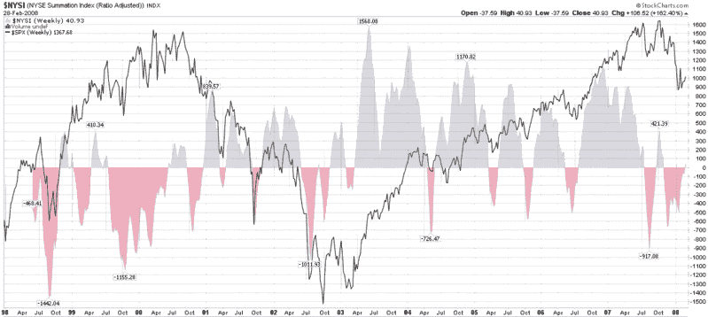

<!--yml

分类：未分类

日期：2024-05-18 18:42:15

-->

# VIX 和更多： McClellan 累计指数转为正面

> 来源：[`vixandmore.blogspot.com/2008/02/mcclellan-summation-index-turns.html#0001-01-01`](http://vixandmore.blogspot.com/2008/02/mcclellan-summation-index-turns.html#0001-01-01)

虽然市场指数下跌 230 点，但我不会因此停止谈论市场转好。

除了市场最近的一次反弹，我认为有几个因素使我相信市场将从当前水平继续上涨。这些因素中的第一个，正如 J.J. McGrath 在他的

[MackTheKnife](http://www.zacks.com/blog/post_info.html?g=32)

博客中，可以看出原本观望的资金开始出现

[回流到共同基金](http://www.zacks.com/blog/comments.php?cid=11726)

目前市场可能尚未形成洪水，但这只是一种试探。第二个因素是持续的极端读数

[put to call ratios](http://vixandmore.blogspot.com/search/label/put%20to%20call)

在

[ISEE](http://vixandmore.blogspot.com/search/label/ISEE)

和

[CBOE 股票 only](http://vixandmore.blogspot.com/search/label/CPCE)

数字所示。这些数字表明，虽然一些机构资金正在回流市场，但许多零售投资者仍然在观望或持空头立场。

考虑压抑需求的第三种方式是查看

[McClellan 累计指数](http://vixandmore.blogspot.com/search/label/McClellan%20Summation%20Index)

，我附在下面的图表中。如图表所示，该指数自 10 月末以来首次转为正面。虽然这并不能保证市场一定会上升，但这一信号历史上看是看涨的。或许更重要的是，可以认为零线下的红色区域代表在熊市期间，压抑的需求继续在水面下累积，大致与红色尖峰的持续时间和幅度成比例。

总结我在此处的想法，两个看涨信号是共同基金将现金投入市场以及 advance decline 数据转为正面，表明市场趋势已经转变。在这个阶段，只有期权情绪数据需要恢复正常，以表明零售投资者再次感到舒适地做多，并帮助推动市场走出最近的交易区间。

 *[来源：StockCharts.com]*
