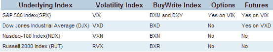

<!--yml

类别：未分类

日期：2024-05-18 15:53:48

-->

# VIX and More: Meet the Spikers

> 来源：[`vixandmore.blogspot.com/2007/03/meet-spikers_16.html#0001-01-01`](http://vixandmore.blogspot.com/2007/03/meet-spikers_16.html#0001-01-01)

四巫日看起来是个和家人团聚的好时机。既然已经介绍了 VIX 的德国表亲[VDAX](http://vixandmore.blogspot.com/search/label/VDAX)，今天我们就来看看美国的这些亲戚。首先，是一个方便的图表：

由于婚姻、离婚、名字变更等因素，对美国扩展家庭的更详细了解可能会变得复杂，但以下是当前市场上五大数据参与者，大致按其重要性排序：

**[VIX](http://www.cboe.com/micro/vix/introduction.aspx)** – 衡量[标普 500](http://www2.standardandpoors.com/portal/site/sp/en/us/page.topic/indices_500/2,3,2,2,0,0,0,0,0,0,0,0,0,0,0,0.html)（SPX）期权的隐含波动率，包括所有近期到期的平值 SPX 看涨和看跌期权以及虚值看涨和看跌期权。排除深度实值期权。 当前的方法自 2003 年 9 月 22 日以来一直在使用。VIX 于 1993 年 4 月 1 日正式推出，但 CBOE 自 1990 年初就开始计算合成历史 VIX 数据。

**[VXN](http://www.cboe.com/micro/vxn/)** – 衡量[纳斯达克 100](http://dynamic.nasdaq.com/dynamic/nasdaq100_activity.stm)（NDX）期权的隐含波动率，包括所有近期到期的平值 NDX 看涨和看跌期权以及虚值看涨和看跌期权。排除深度实值期权。  当前的方法自 2003 年 9 月 22 日以来一直在使用；该指数最初于 2001 年 1 月 22 日推出。

**[VXO](http://www.cboe.com/micro/vxo/)** – 是通过计算 8 个[S&P 100](http://www2.standardandpoors.com/portal/site/sp/en/us/page.topic/indices_100/2,3,2,2,0,0,0,0,0,0,0,0,0,0,0,0.html) OEX 看涨和看跌期权的隐含波动率的加权平均值得出，平均到期时间为 30 天。请注意，这是在 2003 年 9 月 22 日之前计算 VIX 的方法。在那一天，计算 VIX 的方法发生了变化，并引入了新的交易代码和名称，以保持与 2003 年 9 月 22 日之前计算“旧 VIX”的历史方法的连续性。

来自 CBOE 网站的信息：

*"VIX 衡量的是股票指数期权价格所传达的短期市场波动预期。原始 VIX 是通过八个不同的 OEX 期权系列的隐含波动率构建而成，这样，在任何给定时间，它都代表了到期日为恰好 30 天的假设平值 OEX 期权的隐含波动率.*

**新的 VIX 仍然衡量市场对 30 天波动率的预期，但这种方式符合行业从业者最新的思考和研究。新的 VIX 基于标普 500 指数期权的价格，并利用更广泛的行权价格（而不仅仅是平值系列）来融入波动率‘偏斜’的信息。**

**[VXD](http://www.cboe.com/micro/vxd/)** – 衡量[道琼斯工业平均指数](http://www.djindexes.com/mdsidx/?event=showAverages)所有近期平值 DJIA 看涨和看跌期权的隐含波动率，以及所有远期平值和远期看涨和看跌期权。深度实值期权被排除在外。于 2005 年 4 月 25 日引入。

**[RVX](http://www.cboe.com/micro/rvx/)** – 衡量[罗素 2000](http://www.russell.com/indexes/characteristics_fact_sheets/US/Russell_2000_Index.asp)（RUT）所有近期平值 NDX 看涨和看跌期权以及远期看涨和看跌期权的隐含波动率。深度实值期权被排除在外。于 2006 年 5 月 5 日引入。

虽然波动率指数之间的相关性非常高，但正如任何家庭一样，这个家族并不总是以同步的方式行动，下面的图表演示了这一点。在未来的几周里，我将更多地讨论波动率指数之间的分歧，并尝试提供一个解释它们的框架。

