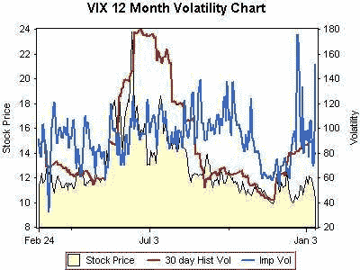

<!--yml

类别：未分类

日期：2024-05-18 16:02:34

-->

# VIX 和更多：元波动率（……或 IV²？）

> 来源：[`vixandmore.blogspot.com/2007/01/metavolatility-or-iv2.html#0001-01-01`](http://vixandmore.blogspot.com/2007/01/metavolatility-or-iv2.html#0001-01-01)

所以……VIX 是隐含波动率的度量，VIX 有期权。这些期权也有隐含波动率。所以……隐含波动率的隐含波动率是什么，它意味着什么？

首先，是简单的一部分。

所以，就是这样。隐含波动率的隐含波动率一年。

在我用更尖锐的分析刀对数据进行更深入分析之前，关于它可能意味着什么，有一些快速的观察：

1. VIX 价格与 30 天历史波动率之间的高度相关性（毫不奇怪）

2. 过去一个月中有一些不同寻常的大型 IV 尖峰

3. 近期 IV 和 VIX 价格趋势之间的背离是不寻常的

4. 过去一年中，VIX IV 似乎平均约为 100

5. 60-70 范围内的 IV 下行尖峰是短暂的，并且似乎提供了一些不错的买入信号

6. VIX IV 是

不是

VIX 的变化率——以及其与同一数据的缺乏相关性是惊人的，至少对我来说是这样
