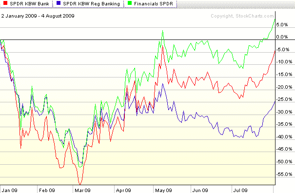

<!--yml

分类：未分类

日期：2024-05-18 17:35:12

-->

# VIX 和更多：货币中心银行飙升，区域银行落后

> 来源：[`vixandmore.blogspot.com/2009/08/money-center-banks-surge-as-regional.html#0001-01-01`](http://vixandmore.blogspot.com/2009/08/money-center-banks-surge-as-regional.html#0001-01-01)

尽管在我打下这些字时标普 500 指数下跌了约 0.8%，但银行今天的表现明显好于指数，延续了近期的一个趋势。然而，在整个银行领域的买入兴趣是分散的，对货币中心银行有强烈的需求，而对区域银行的关注较少。

以下图表比较了两种流行的银行交易型开放式指数基金（ETFs）的表现，[KBE](http://vixandmore.blogspot.com/search/label/KBE)是基于广泛银行指数的，而[KRE](http://vixandmore.blogspot.com/search/label/KRE)则是基于区域银行指数的。对比鲜明。不仅今天 KBE 上涨了 2.2%，而 KRE 略有下跌，而且自 4 月底以来，当区域银行成为落后者以来，这一主题一直反复出现。请注意，这两个银行 ETF 的表现都落后于由似乎无处不在的[XLF](http://vixandmore.blogspot.com/search/label/XLF)代表的整个金融部门的表现。

在过去的两天里，卖家未能在房地产或金融部门造成重大影响。除非这种模式发生逆转，否则股市将无法实现调整。

来源：[StockCharts]
