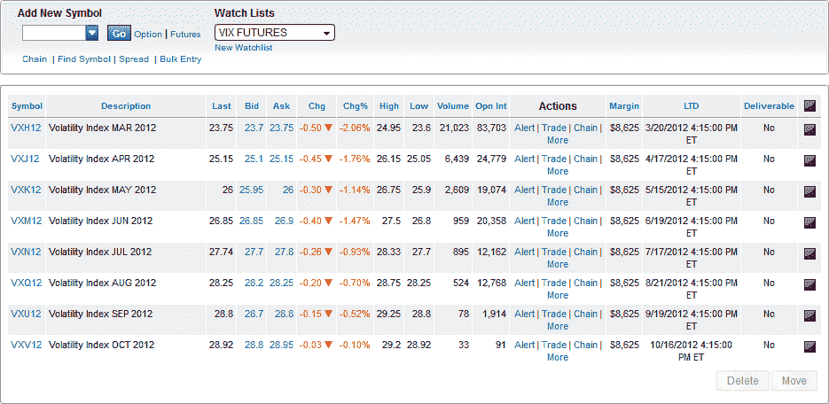
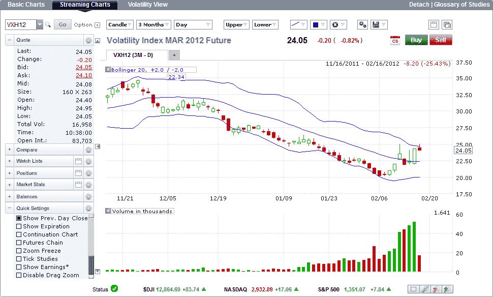

<!--yml

分类：未分类

日期：2024-05-18 16:40:01

-->

# VIX 和更多：监控 VIX 期货及其对 VIX ETPs 的影响

> 来源：[`vixandmore.blogspot.com/2012/02/monitoring-vix-futures-and-their-impact.html#0001-01-01`](http://vixandmore.blogspot.com/2012/02/monitoring-vix-futures-and-their-impact.html#0001-01-01)

今天早上就是那种股票上涨、VIX 上涨，一些[VIX 期货](http://vixandmore.blogspot.com/search/label/VIX%20futures)的涨幅甚至超过现金 VIX——至少在最新的希腊消息发布之前是这样的。

正是在这样的日子里，我的收件箱总会收到几个新近接触[VIX 交易所交易产品](http://vixandmore.blogspot.com/search/label/VIX%20ETN)（ETPs）如[XIV](http://vixandmore.blogspot.com/search/label/XIV)或[ZIV](http://vixandmore.blogspot.com/search/label/ZIV)的交易员发来的问题，他们无法理解为什么这些产品没有随标普指数（SPX）波动，或者与 VIX 相反方向变动。当然，答案是这些产品并不追踪标普指数（SPX），甚至不追踪现金 VIX，而是追踪 VIX 期货。

许多交易者在处理 VIX ETPs 的 VIX 期货部分时遇到困难的原因是，他们的经纪账户被授权进行股票和 ETP 交易，在某些情况下还有期权，但没有期货。此外，大多数股票经纪人不提供可交易的期货，而允许进行期货交易的大部分人并不在菜单上提供 VIX 期货（这主要是由于 SEC 和 CFTC 之间的监管分裂，但我稍微偏题了……）

那么 VIX ETP 投资者该怎么办呢？

嗯，VIX 期货报价始终可以在 CBOE 期货交易所（CFE）的[主页面](http://cfe.cboe.com/)上找到。不幸的是，这些报价延迟了 15 分钟。

然而，有两家流行的期权经纪商也提供 VIX 期货报价。这些中的第一家是[Interactive Brokers](http://www.interactivebrokers.com/en/main.php)（[IBKR](http://vixandmore.blogspot.com/search/label/IBKR)），以其可用于交易的广泛产品、技术和低交易成本而闻名。他们并不以手把手教学和高水平的客户服务而闻名。如果你已经在那里有一个账户并且熟悉操作，或者习惯于自己解决问题，并且偏爱自助模式，这可能是你获取 VIX 期货报价的最佳选择。

对于那些刚接触 VIX 期货且更倾向于拥有强大客户服务安全网的新手来说，更好的选择可能是[optionsXpress](http://www.optionsxpress.com/)，该公司于 2011 年 3 月被 Charles Schwab 收购。Optionsxpress 为期权交易者提供了优秀的工具集，也为期货交易者提供了一定的功能。尽管 Interactive Brokers 在低成本自助服务模式方面表现出色，但 optionsXpress 更倾向于高接触模式，并为此类额外服务收取更多费用。简而言之，对于刚接触期货和 VIX ETP 的新手来说，optionsXpress 可能是更好的选择。

下面是我在 optionsXpress 中创建的(可自定义的)VIX 期货观察名单，按最后交易日期(LTD)进行了排序，以及他们为 VIX 2012 年 3 月期货合约 VXH12 提供的一个实时图表快照。请注意，数据量相当大，以及高度可自定义的图表。

市场上还有其他经纪人，但我的猜测是，对于 VIX ETP 新手来说，他们更有可能在 optionsXpress 上有一个现有账户，而不是其他也允许交易 VIX 期货的股票/期权经纪人。如果没有，optionsXpress 仍然是开始接触期货交易，特别是 VIX 期货交易的好地方。

相关文章：

**

**[来源(s): optionsXpress.com]*

***披露(s):*** *在撰写本文时持有 XIV 和 ZIV 多头头寸*
