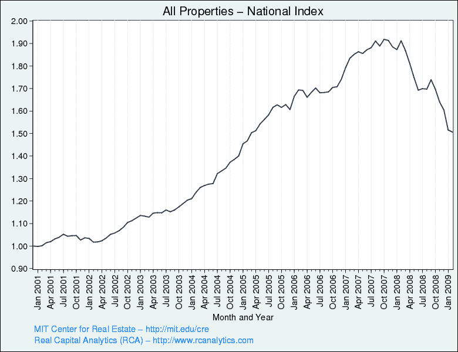

<!--yml

分类：未分类

日期：2024-05-18 17:50:06

-->

# VIX 和更多：Moodys/REAL 商业地产价格指数

> 来源：[`vixandmore.blogspot.com/2009/04/moodysreal-commercial-property-price.html#0001-01-01`](http://vixandmore.blogspot.com/2009/04/moodysreal-commercial-property-price.html#0001-01-01)

上周，在[商业地产问题堆积如山](http://vixandmore.blogspot.com/2009/04/commercial-real-estate-problems-piling.html)一文中，我提到[商业地产](http://vixandmore.blogspot.com/search/label/commercial%20real%20estate)可能是引发下一次金融危机的潜在候选者。由于[S&P/Case-Shiller 住宅价格指数](http://www2.standardandpoors.com/portal/site/sp/en/us/page.topic/indices_csmahp/0,0,0,0,0,0,0,0,0,2,1,0,0,0,0,0.html)受到了很多关注，我认为这是一个提到一个应受到更多关注的商业地产指数的好机会：这就是[Moodys/REAL 商业地产价格指数](http://web.mit.edu/cre/research/credl/rca.html)。

这个指数上次更新是在 2007 年 10 月 24 日，显示自那时以来，商业地产价格已经下降了超过 20%。

虽然住宅价格很重要，但大部分住宅市场的故事已经说完。房地产故事的其余部分——无论好坏——很可能在商业地产方面。

*[source: MIT Center for Real Estate, Real Capital Analytics]*
