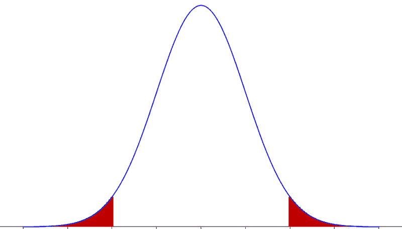

<!--yml

category: 未分类

date: 2024-05-18 17:37:25

-->

# VIX and More: More Questions About Bollinger Bands

> 来源：[`vixandmore.blogspot.com/2009/07/more-questions-about-bollinger-bands.html#0001-01-01`](http://vixandmore.blogspot.com/2009/07/more-questions-about-bollinger-bands.html#0001-01-01)

昨天的帖子[StockCharts.com Charts on the Blog](http://vixandmore.blogspot.com/2009/07/stockchartscom-charts-on-blog.html)引发了几位读者关于[Bollinger 带](http://vixandmore.blogspot.com/search/label/Bollinger%20bands)数据的性质以及这些带状图对交易者的有用性的问题。

一位读者问我是否有意说两个标准差应该包含 95.45%。虽然这是高斯分布或[正态分布](http://en.wikipedia.org/wiki/Normal_distribution)所期望的，但股价的分布并不遵循正态分布。实际上，它们往往有肥尾或统计学家所说的正[峰度](http://en.wikipedia.org/wiki/Kurtosis)。

在[Bollinger on Bollinger Bands](http://www.amazon.com/Bollinger-Bands-John/dp/0071373683/ref=sr_1_1?ie=UTF8&s=books&qid=1248306828&sr=1-1)一书中，John Bollinger 谈论了他所做的广泛研究，这些研究表明 Bollinger 带并没有捕捉到像正常分布统计学预期那样多的数据。

Bollinger 在他的发现中描述如下：

> “*大约只有 89%的数据包含在 2 个标准差带中，而我们期望的是 95%。*
> 
> 有两个可能的原因导致我们没有达到预期的那样高的控制水平——即 2 个标准差范围内的 95%左右。首先，我们使用的是总体计算，这导致比样本计算更紧的带状图。其次，股价的分布不是正态的——在极端值处的观察值比预期的要多——所以带状图外也有更多的数据点。毫无疑问还有更多的因素，但这些都似乎是主要因素。”

*另一位读者对 Bollinger 带提出了以下批评：

> *“我一直不明白 Bollinger 带的价值。它们不能提供波动性的度量，因为随着图表的波动性增加，带状图也会扩大。人们可能会查看带状图的宽度来估计波动性。但这似乎是一个非常不精确的度量。它并没有真正突出。历史波动性的图表会更有用得多。
> 
> 它们也不能帮助估计回归到平均值可能发生的时间。再次，当项目离平均值越远，带状图就越大。有很多情况下，图表触及带状图的极端值，但继续前进——带状图随之扩大。”*

虽然我不想为 Bollinger Bands 辩护，但重要的是要注意，这是衡量[历史波动性](http://vixandmore.blogspot.com/search/label/historical%20volatility)的一种方法（尽管不是标准方法）并且它们为那些希望直观观察相对波动性起伏的人提供了一种视觉简写。

实际上，[Bollinger 宽度](http://vixandmore.blogspot.com/search/label/Bollinger%20band%20width)是一种统计上衡量历史波动性的方法，而不是依赖图表，我在博客上（见上方链接中的例子）多次使用这个指标来衡量波动性。

关于 Bollinger Bands 的预测价值，我发现它们可以是一个有用的指标——特别是与 VIX 一起——并且它们预测性随着 VIX 与均值的偏差标准差增加而增加。虽然 2008 年 10 月和 11 月不是运用这一策略的好时机，但总体而言，我相信 Bollinger Bands 通常会提供一些关于均值回归可能性的有帮助的信息。

最后，有一些交易者喜欢交易波动性趋势，而不是使用均值回归方法。波动性趋势交易者在股票在均值+1.0 到+2.0 标准差之间交易时可能会开盘并保持多头头寸，并在 Bollinger 带线被违反时关闭这些头寸。

对于那些对 Bollinger Bands 感兴趣并想了解更多内容的人来说，Bollinger 本人关于这个主题的书籍（见上方）可能是最终的权威之作。读者也鼓励去查看我大约一年前发表的关于 Bollinger Bands 三个重要参数的三部分系列文章：

1.  [Bollinger Bands:为什么是 20 天？](http://vixandmore.blogspot.com/2008/06/bollinger-bands-why-20-days.html)

1.  [Bollinger Bands 与标准差设置](http://vixandmore.blogspot.com/2008/06/bollinger-bands-and-standard-deviation.html)

1.  [Bollinger Bands 与 Percent B 设置](http://vixandmore.blogspot.com/2008/06/bollinger-bands-and-percent-b-setting.html)

*
