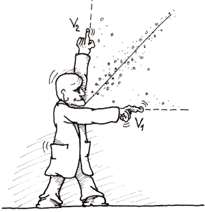

<!--yml

分类：未分类

日期：2024-05-18 18:58:11

-->

# VIX 和更多：关于 SPX-VIX 相关性的更多想法和数字

> 来源：[`vixandmore.blogspot.com/2007/10/more-thoughts-and-numbers-on-spx-vix.html#0001-01-01`](http://vixandmore.blogspot.com/2007/10/more-thoughts-and-numbers-on-spx-vix.html#0001-01-01)

我曾在这个空间里谈论过 VIX 和 SPX 之间的[相关性](http://vixandmore.blogspot.com/search/label/SPX-VIX%20correlation)，[SPX:VIX 比率](http://vixandmore.blogspot.com/search/label/SPX%3AVIX)以及其他一些相关话题。有些人可能已经准备好尖叫“已经足够了！”但现在是时候我们*真正*严肃地对待这个话题了。

让我们从昨天开始。如果你混迹于某些博客圈子，至少会有很多人谈论 SPX 上涨 1.33%而 VIX 仅下跌 0.89%是多么的不寻常。VIX 的这种温和变动在理论上似乎是合理的，因为“众所周知”，VIX 通常与 SPX 走势相反，并且变动速度更快。支持这种信念的数字在哪里？嗯，我将在这个空间里逐渐展示这些数字，但不会一次性展示完，这样每个人在洪水来临前都有机会转移到更高的地面。

使用 1990 年的数据，有一些数字值得我们思考：

+   VIX 和 SPX 在 76%的交易日子里走势相反。

+   当 VIX 和 SPX 走势相同的时候，它们上涨的可能性大于下跌。

+   以百分比计算，VIX 的日常平均变动是 SPX 的-4.2 倍。

回到昨天，SPX 在前七次上涨 1.33%的情况下，VIX 都下跌了，平均跌幅为 6.3%，最大跌幅为 10.1%，最小跌幅为 1.4%。在这七个前例中，当 VIX 跌幅最大（10.1%）时，SPX 在接下来的 10 天、20 天和 50 天内的涨幅最大；当 VIX 跌幅最小（1.4%）时，SPX 在接下来的 10 天、20 天和 50 天内的表现最差。我知道这只是七个数据点，但历史对昨天 VIX 的表现并不看好。

我将在不久的将来对这个话题进行更多的讨论，并且会有更多的统计学意义。
