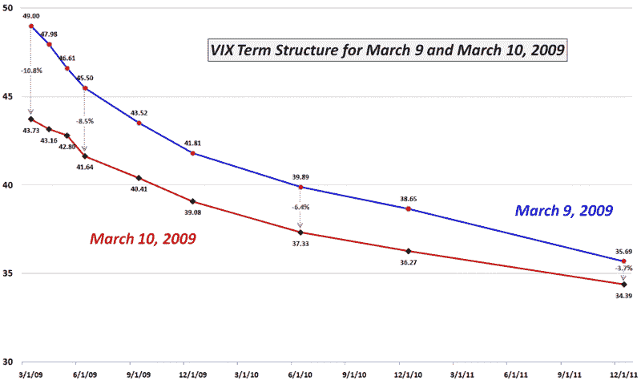

<!--yml

分类：未分类

日期：2024-05-18 17:56:11

-->

# VIX and More: More Volatility + Less Fear = Lower VIX?

> 来源：[`vixandmore.blogspot.com/2009/03/more-volatility-less-fear-lower-vix.html#0001-01-01`](http://vixandmore.blogspot.com/2009/03/more-volatility-less-fear-lower-vix.html#0001-01-01)

昨日股市上涨导致 SPX 上涨 6.4%，将 SPX 的 10 日和 20 日历史波动性推高至自 12 月以来未见的水平。尽管很少有投资者确信上周的低点现在已经安全，但越来越多的人认为市场已经远离悬崖边缘，足够大家深呼吸了。

所以我们看到了更多的波动性和更少的[恐慌](http://vixandmore.blogspot.com/search/label/fear)——昨日股市上涨时 VIX 下跌了 10.7%。

当然，VIX 是关于前瞻性波动的，而不过分关注[历史波动](http://vixandmore.blogspot.com/search/label/historical%20volatility)，尽管两者之间有很高的相关性。

在我看来，SPX 暴力上涨导致 VIX 下跌的原因有几个因素。如上所述，其中之一是市场上涨时 VIX 的恐慌成分较小。另一个重要因素是 SPX 大幅上涨时，冲向购买看跌期权保护的投资者数量较少，对价格的关注不足。最后，历史表明，市场下跌的幅度通常比上涨要大，因此统计波动率指标在 SPX 大幅下跌时可能会显示出比大幅上涨时更高的波动性。

下表显示了从周一收盘到昨日收盘 VIX [期限结构](http://vixandmore.blogspot.com/search/label/term%20structure)的变化。与往常一样，VIX 在前几个月的最大跌幅中，两个前几个月的波动性下降了约 10%。另一方面，15 个月后的 SPX 期权显示波动性下降了 6.4%，与前几个月相比这是一个相对较高的比率。我认为，远期月份反映的不仅仅是短期担忧的变化，还有一种感觉，即[结构性波动](http://vixandmore.blogspot.com/search/label/structural%20volatility)和系统风险在当前时间的担忧程度比之前想象的要小。

*[来源：CBOE, VIX and More]*
