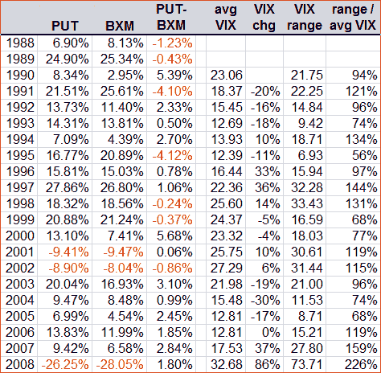
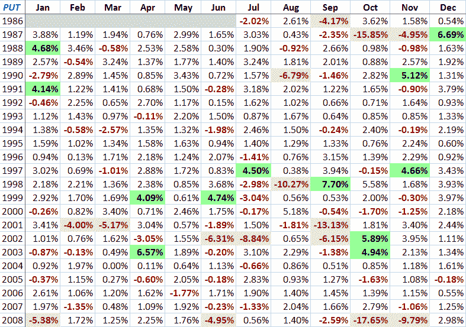

<!--yml

分类：未分类

日期：2024-05-18 18:06:27

-->

# 波动率指数（VIX）及其更多内容：关于 PUT 回报的更多讨论

> 来源：[`vixandmore.blogspot.com/2009/01/more-on-put-returns.html#0001-01-01`](http://vixandmore.blogspot.com/2009/01/more-on-put-returns.html#0001-01-01)

鉴于对看跌期权策略[put-write](http://vixandmore.blogspot.com/search/label/put-write)和芝加哥期权交易所看跌期权指数（[PUT](http://vixandmore.blogspot.com/search/label/PUT)）的兴趣日益浓厚，我花了一些额外的时间研究 PUT 数据，看看我能发现什么秘密。

我必须承认，我越挖掘，就越对这种看跌期权策略方法感到好奇。由于人们就 PUT 和与之紧密相关的 CBOE 买入期权（[BXM](http://vixandmore.blogspot.com/search/label/BXM)）指数回报差异进行了相当多的讨论，我将首先展示一个逐年比较 PUT 和 BXM 的表格。为了好玩，我还加入了每年平均波动率指数（VIX）、平均 VIX 年度变化、当年 VIX 范围以及该范围与平均 VIX 之比。虽然这些额外数据点没有提供决定性的证据，但每个数据点都提供了整体表现谜题的一块拼图。

第二张图表是自 1986 年以来 PUT 月回报的简单矩阵。不出所料，回报最差的两个月是在 1987 年和 2008 年的波动高峰期间。作为一个相关说明，PUT 在波动事件后盈利最多的几个月之一。

来源：[美国期权交易所（CBOE），波动率指数及其更多内容]

对于那些想要更深入探讨这个问题的人来说，考虑到看跌期权绝对回报和相对回报在很大程度上是隐含波动率、标普 500 指数的趋势特征和利率的函数。还要注意，上面的图表仅回溯到 1988 年 6 月 1 日，因为那是标准普尔公司开始报告标普 500 Total Return Index 每日股息的时候。
