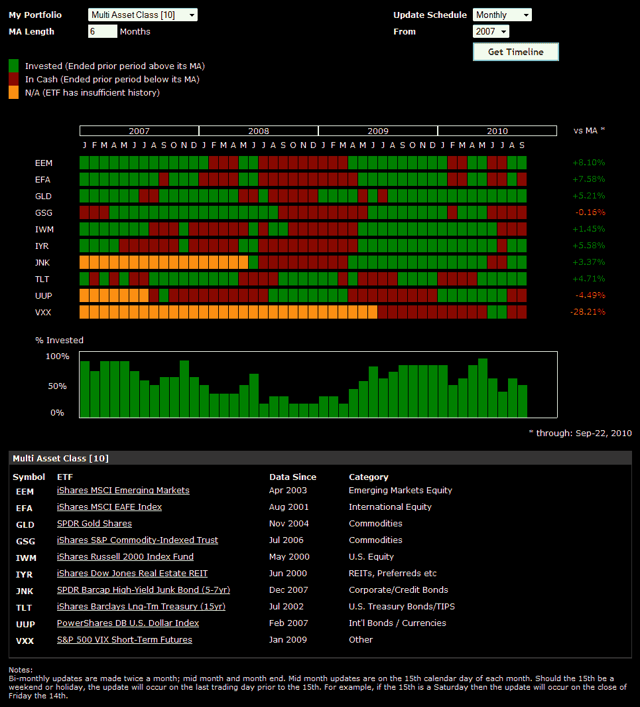

<!--yml

分类：未分类

日期：2024-05-18 17:02:47

-->

# VIX and More: 关于多资产类 ETF 投资组合的更多内容

> 来源：[`vixandmore.blogspot.com/2010/09/more-on-multi-asset-class-etf-portfolio.html#0001-01-01`](http://vixandmore.blogspot.com/2010/09/more-on-multi-asset-class-etf-portfolio.html#0001-01-01)

昨天的帖子[多样化、动量以及避开 2008 年的恐慌](http://vixandmore.blogspot.com/2010/09/diversification-momentum-and.html)收到了如此积极的反馈，我认为有必要写一个简短的后续。

下面这张图表，来自[ETFreplay.com](http://etfreplay.com/)，展示了昨天提到的多资产类 ETF 投资组合的月度表现，这次使用了 ETFreplay 的[投资组合移动平均时间线工具](http://etfreplay.com/members/timeline_portfolioma.aspx)。这个图表实际上是一个表格，展示了所有 ETF 以及决定每个月是持长仓还是现金的移动平均规则的结果。这个图表的右下角还显示了每个 ETF 目前相对于其选择的（在这个案例中是六个月）移动平均的位置。最后，底部的柱状图也显示了每个月总 ETF 投资组合中持长仓的百分比。

顺便说一下，有人询问关于基于基本面数据的股票回测网站的建议。我建议他查看[Portfolio123.com](http://www.portfolio123.com/)，这个网站在下面链接的底部讨论过。

相关帖子：

*[来源：ETFreplay.com]*

***披露(s):*** *无*
