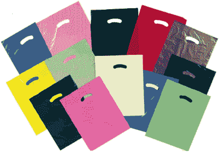

<!--yml

分类：未分类

日期：2024-05-18 18:33:35

-->

# 波动率与更多：NDX 下跌 4%，投资者商业日报（IBD）的袋子指标是黄色的…

> 来源：[`vixandmore.blogspot.com/2008/06/ndx-drops-4-and-ibd-bag-indicator-is.html#0001-01-01`](http://vixandmore.blogspot.com/2008/06/ndx-drops-4-and-ibd-bag-indicator-is.html#0001-01-01)

本月早些时候，我稍微谈到了与标普 500 指数（SPX）一日下跌 3%相关的[均值回归](http://vixandmore.blogspot.com/search/label/mean%20reversion)反弹，在[波动率激增与标普 500 指数下跌不一定是同一枚硬币的两面](http://vixandmore.blogspot.com/2008/06/vix-spikes-and-spx-drops-are-not.html)。

昨天，纳斯达克 100 指数（[NDX](http://vixandmore.blogspot.com/search/label/NDX)）下跌了 4%，不足为奇的是，NDX 在过去 33 年中 4%的跌幅记录表明，昨天的痛苦之后，反弹再次可能出现。我发现特别有趣的是，在 4%的 NDX 跌幅之后，反弹的生命期只有一个多月，在此之后任何额外的收益都会回归到历史常态。事实上，反弹后的最大优势在约十交易日后达到顶峰，然后开始逐渐侵蚀。查看所有 108 个 4%跌幅的数据，平均表现从第十天开始下降，并且在那个 4%跌幅之后的 2-6 个月内明显看跌。

这种统计上的牛市陷阱部分原因是 2000-2003 年期间 NDX 的 4%跌幅相对较高（占 33 年期间研究中的所有 4%跌幅的 75%），这使得数据呈现出看跌的色彩。

那么关于 IBD 的袋子呢？嗯……有人决定大约一周前给我试用订阅《投资者商业日报》（[Investor’s Business Daily](http://www.investors.com/)）。起初几天我翻阅这份报纸，并微笑着注意到它被装在一个绿色的塑料袋里。昨天，报纸用黄色的袋子送来，我不禁想知道这是否是[比尔·奥尼尔](http://en.wikipedia.org/wiki/William_O%27Neil)或上帝或也许两者的某种信号。当然，市场在黄色袋子那天暴跌。所以今天我迫不及待地看看袋子是什么颜色，结果又是黄色。这次市场只下跌了 0.7%，但一天还长着呢。我很好奇，当报纸用红色袋子送来时意味着什么？
