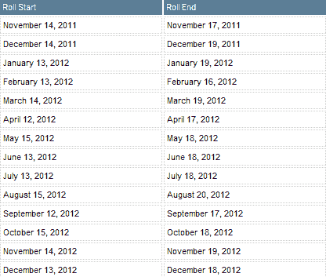

<!--yml

类别：未分类

日期：2024-05-18 16:41:43

-->

# VIX 和更多：天然气、正向市场和 UNG

> 来源：[`vixandmore.blogspot.com/2012/02/natural-gas-contango-and-ung.html#0001-01-01`](http://vixandmore.blogspot.com/2012/02/natural-gas-contango-and-ung.html#0001-01-01)

我在这个平台上已经详细讨论过[正向市场](http://vixandmore.blogspot.com/search/label/contango)和负[滚动收益率](http://vixandmore.blogspot.com/search/label/roll%20yield)问题，这些问题困扰着[VXX](http://vixandmore.blogspot.com/search/label/VXX)。 periodically 这些讨论会引发读者关于持续正向市场对其他 ETP 产品影响的问题。

只是为了澄清，就 ETP 而言，正向市场和[反向市场](http://vixandmore.blogspot.com/search/label/backwardation)问题仅限于那些在其投资组合中持有期货的产品。大部分基于期货的 ETP 属于商品领域，但至少在理论上，任何有期货的证券都可能最终会有基于期货的 ETP。幸运的是，ETFdb 在其[基于期货的 ETF 页面](http://etfdb.com/type/commodity/exposure/futures-based/)上维护了一个方便的产品列表。

我在 VIX 基于 ETP 的正向市场背景下谈论这么多原因是因为 VIX 产品倾向于产生与其他产品相比非常高的负滚动收益率（目前在 VIX 期货的前两个月为每月 11%）.

在 VIX 产品领域之外，正向市场在[原油](http://vixandmore.blogspot.com/search/label/crude%20oil)和天然气中可能最为臭名昭著——以及这些商品最受欢迎的 ETP 产品，[USO](http://vixandmore.blogspot.com/search/label/USO)和[UNG](http://vixandmore.blogspot.com/search/label/UNG)。尽管如此，这些产品的正向市场通常远小于 VXX，但现在 UNG 中的正向市场异常高。目前，USO 中的前两个月正向市场仅为 0.4%，而 UNG 中为每月 7.6%。

请注意，与 VXX 不同，后者每天滚动一次，UNG 在其整个投资组合中每四天滚动一次。更好的是，UNG 发布了一个滚动日期的计划，如下所示，尽管它附带了这样的免责声明，“滚动日期是预测的，可能会在没有通知的情况下更改。”

所以……虽然对于那些做空天然气的人来说已经是一个伟大的年份，但持续的正向市场可能会使做空 UNG 的位置在未来更加有利可图。

最后，也是最重要的，要牢记急剧的正价差并不会无缘无故出现。相反，正价差本质上反映了市场对未来价格走势（扣除[持仓成本](http://en.wikipedia.org/wiki/Cost_of_carry)）的预期。从这一角度来看，UNG 的正价差 7.6%意味着空头从负滚动收益中获得 7.6%的好处是因为市场预期在未来一个月内价格将反弹 7-8%左右。正价差和滚动收益绝非免费午餐，但从中长期来看，如果风险能得到妥善管理，从正价差中受益的头寸应该能够至少支付几顿午餐的费用。

相关文章：

*[来源(s): 美国天然气基金]*

****披露(s):*** *在撰写本文时做空 VXX 和 UNG*
