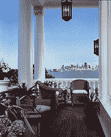

<!--yml

分类：未分类

日期：2024-05-18 18:51:12

-->

# VIX 和更多：街区房价保持稳定

> 来源：[`vixandmore.blogspot.com/2007/12/neighborhood-home-values-holding-up.html#0001-01-01`](http://vixandmore.blogspot.com/2007/12/neighborhood-home-values-holding-up.html#0001-01-01)

一个月前，在[另一场泡沫](http://vixandmore.blogspot.com/2007/11/other-bubble.html)一文中，我提到我住在加利福尼亚州**马林县**，位于**旧金山**北部，并对当地房地产市场的强劲势头发表了评论。然而，情况似乎比我预期的要好。

在所有关于次贷危机和即将到来的金融灾难的谈论中，我发现有趣的是，我住的地方不远，一栋房子刚刚以 6.5 亿美元的价格成交——这是要价的全额。华尔街日报今天早上[报道](http://online.wsj.com/article/SB119757552962127329.html?mod=pj_main_hs_coll)了这一消息，但一篇旧福布斯杂志对[加利福尼亚最贵房子](http://www.forbes.com/2005/02/28/cx_sc_0228how.html)的报道是了解更多关于[洛克斯利厅](http://www.suzmancole.com/portfolio/residential/traditional/locksley.php)的更好选择，目前由全球矿业大亨[罗伯特“有毒鲍勃”弗里德兰德](http://www.forbes.com/lists/2006/10/QXNL.html)拥有，他通过帮助将[苏明维尔矿](http://en.wikipedia.org/wiki/Summitville_mine)变成最著名的[超级基金](http://en.wikipedia.org/wiki/Superfund)污染场地之一而获得了他的绰号。

虽然我周三提到我最近在交易方面表现不错，但我急于补充说我**不是**买家。到目前为止，买家的名字还没有公开披露。然而，值得注意的是，一个在当地著名的名字是[奥利维亚·徐·德克](http://www.sfgate.com/cgi-bin/article.cgi?f=/c/a/2006/04/09/CMGU1HQ4PR1.DTL&hw=malin+giddings&sn=001&sc=1000)，她负责 listing，她的[网站](http://www.sanfranciscofinehomes.com/)如果你对房子嫉妒的话，浏览起来很有趣。

弗里德兰德对原屋进行了大规模翻修，各种来源列出目前的面积在 10,000 至 12,000 平方英尺之间。然而，我必须说，每平方英尺 6,000 美元并不夸张[在该地区](http://www.trulia.com/CA/Belvedere/#for_sale/Belvedere,CA/price;d_sort/)，尤其是考虑到从该地点观看的景色通常被认为是世界上最好的五景之一。

无论如何，这笔交易将使该地区的平均房屋销售价格统计数据变得有趣。也许有一天我可以尝试将其作为比较...
