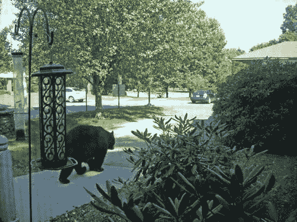

<!--yml

category: 未分类

date: 2024-05-18 18:29:09

-->

# VIX and More: 新逆向情绪指标？

> 来源：[`vixandmore.blogspot.com/2008/08/new-contrarian-sentiment-indicator.html#0001-01-01`](http://vixandmore.blogspot.com/2008/08/new-contrarian-sentiment-indicator.html#0001-01-01)

我的父亲住在康涅狄格州的郊区，那里鹿很多，但其他大型哺乳动物就很少了。至少我以为是这样。显然，一个邻居昨天看到一只熊沿着我父亲的车道走。

出于好奇，我去了谷歌搜索该地区的熊出没情况，结果惊讶地发现几天前在邻近的辛姆布里镇有一个关于[另一只熊的出现](http://www.courant.com/news/local/fv/hc-simbear0823.artaug23,0,6554915.story)的报道，照片是由一位警觉的克里斯·安德森在一家保险公司内拍摄的。现在我开始真正好奇：在曼哈顿下城区没有足够空间漫游的熊有多少只，它们已经搬到康涅狄格州安家？确切的数字是个谜，但据康涅狄格州环境保护部门称，过去一年该州有[1349 次黑熊目击记录](http://www.depdata.ct.gov/wildlife/sighting/bearsight.asp)。考虑到我已经 30 年没住在那个州了，这个数字比我预期的要多 1330 倍。顺便说一下，辛姆布里似乎是康涅狄格州的熊之都，有 229 次目击——大约是每三天两次。

投资者请注意：斯坦福和格林威治是基金满地走的地方，但过去一年里那里并没有报告任何熊的出现。
