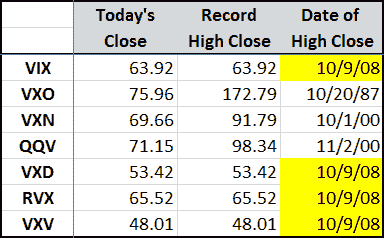

<!--yml

分类：未分类

日期：2024-05-18 18:22:13

-->

# VIX 和更多：波动性指数的新纪录收盘价

> 来源：[`vixandmore.blogspot.com/2008/10/new-record-close-for-volatility-indices.html#0001-01-01`](http://vixandmore.blogspot.com/2008/10/new-record-close-for-volatility-indices.html#0001-01-01)

今天戏剧性的最后一小时抛售导致了七个主要美国波动性指数中的四个创下了新的纪录收盘价，包括 VIX，首次超过 60，并创下了 63.92 的新纪录收盘价。除了 VIX 之外，[VXD](http://vixandmore.blogspot.com/search/label/VXD)（CBOE DJIA 波动性指数）和[RVX](http://vixandmore.blogspot.com/search/label/RVX)（CBOE 罗素 2000 波动性指数）也创下了新纪录。

请注意，这些波动性指数有不同的生命周期和数据历史，因此跨指数的全部纪录高点比较并不总是特别相关。要了解更多关于所有波动性指数的信息，请尝试[美国波动性指数概览](http://vixandmore.blogspot.com/2008/08/overview-of-us-volatility-indices.html)。
