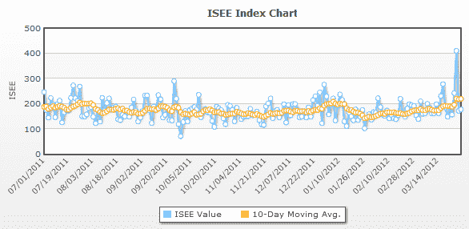

<!--yml

类别：未分类

日期：2024-05-18 16:34:25

-->

# VIX 和更多：周一 ISEE 股票仅指数创单日新高

> 来源：[`vixandmore.blogspot.com/2012/03/new-single-day-high-in-isee-equities.html#0001-01-01`](http://vixandmore.blogspot.com/2012/03/new-single-day-high-in-isee-equities.html#0001-01-01)

在 VelocityShares Daily 2x VIX Short-Term ETN ([TVIX](http://vixandmore.blogspot.com/search/label/TVIX))引起的轩然大波中，周一期权和市场[情绪](http://vixandmore.blogspot.com/search/label/sentiment)世界发生了一个历史性事件：[ISEE](http://vixandmore.blogspot.com/search/label/ISEE)股票仅[看涨至看跌](http://vixandmore.blogspot.com/search/label/put%20to%20call)比率创下了新的单日高点。

对于那些可能不熟悉 ISEE 的人来说，这个比率是由国际证券交易所（ISE）开发的，它是通过将 ISE 客户购买的开盘看涨期权除以 ISE 客户购买的开盘看跌期权，然后乘以 100 计算得出的。股票仅全额交易的一部分意味着所有与指数和 ETP 的交易都被排除在这个数据之外，这也减少了 ISEE 股票仅数据中包含主要用于投资组合对冲的交易的可能性。

周一收盘创纪录的 410 意味着 ISE 客户买入的看涨期权是看跌期权的四倍。因为日常数据往往有很多噪音，我喜欢将数据平均值 over a 10-day period. 下面的图表显示了自 2011 年 7 月以来的 ISEE 股票仅指数，以及 10 日移动平均线。

通常，看跌至看涨数据被认为是[逆向指标](http://vixandmore.blogspot.com/search/label/contrary%20indicators)，它标志着当大众变得过于乐观或恐慌时。在周一至少，乐观情绪——理性或不理性——正在泛滥，这可能是因为越来越多证据表明可能进行 QE3 活动，以及[伯南克看涨期权](http://vixandmore.blogspot.com/search/label/Bernanke%20put)的普遍存在。

值得一提的是，此前 ISEE 股票仅指数的单日高点可追溯到 2010 年 12 月，当时股票正处于一个为期六个月的牛市行情中，这一行情在几个方面类似于当前的行情，并将 SPX 从 1039 带到 1344。

相关文章：

**

*[来源(s): 国际证券交易所]*

***披露(s):*** 在撰写本文时 short TVIX
