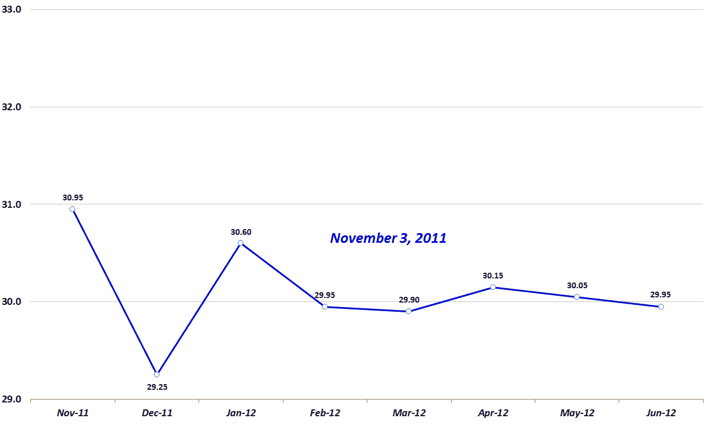

<!--yml

分类：未分类

日期：2024-05-18 16:47:55

-->

# VIX 和更多：新的 VIX 反向市场记录

> 来源：[`vixandmore.blogspot.com/2011/11/new-vix-backwardation-record.html#0001-01-01`](http://vixandmore.blogspot.com/2011/11/new-vix-backwardation-record.html#0001-01-01)

这周标志着前端两个月首次连续三个月每天都处于[VIX 期货](http://vixandmore.blogspot.com/search/label/VIX%20futures) [期限结构](http://vixandmore.blogspot.com/search/label/term%20structure) 的[反向市场](http://vixandmore.blogspot.com/search/label/backwardation)状态。实际上，当前的连续 68 天已经超过了 2008 年金融危机期间的 63 天旧记录。

尽管过去两周内，前端两个月的反向市场状况一直保持不变，但当我们观察到完整的 VIX 期货期限结构时，期货曲线已经回归到[正向市场](http://vixandmore.blogspot.com/search/label/contango)状态五次。前端两个月保持反向市场状态，而其他 VIX 期货期限结构则回归正向市场状态的主要原因是与我所说的“[假日效应](http://vixandmore.blogspot.com/search/label/Holiday%20Effect)”或“[日历反转](http://vixandmore.blogspot.com/search/label/calendar%20reversion)”有关。实质上，大约两周前发生的事情是，从十月前端月份到十一月前端月份 VIX 期货的滚动，以及从十一月第二个月到十二月第二个月 VIX 期货的滚动，为前端两个月增加了额外的假日效应反向市场状态。这是因为第二个月 VIX 期货的到期日是 12 月 21 日，由于假日季节通常伴随着较低波动性，因此这些期货价格被人为压低。所有购买第二个月（十二月）VIX 期货的短期 VIX 期货交易所交易产品（ETPs），在每日再平衡过程中以人为压低的价格买入，同时卖出前端月份（十一月）VIX 期货，都感受到了这种影响。

下面的图表显示了前端一个月和第二个月 VIX 期货之间的 1.70 点差异。请注意，直到 2012 年 2 月，期限结构才开始趋于平坦，因为投资者开始趋同于这样一个观点，即 VIX 在明年上半年很可能会围绕 30 水平波动。

相关文章：

**

*[来源：Interactive Brokers]*

***披露(s):*** *在撰写本文时做空 VIX*
