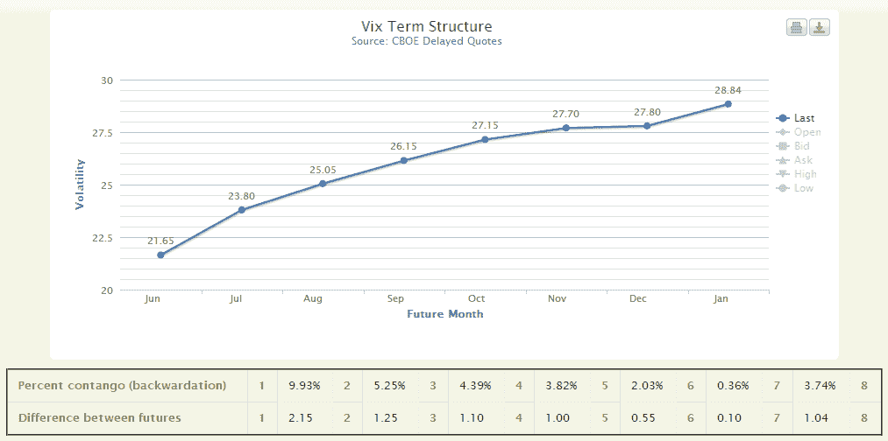

<!--yml

分类：未分类

日期：2024-05-18 16:28:30

-->

# VIX 和更多：新奇事物：VIXcentral.com

> 来源：[`vixandmore.blogspot.com/2012/06/new-and-noteworthy-vixcentralcom.html#0001-01-01`](http://vixandmore.blogspot.com/2012/06/new-and-noteworthy-vixcentralcom.html#0001-01-01)

作为一个以 VIX 和相关主题为中心的博客，我总是努力保持对 VIX 和波动性的新信息、分析、数据、工具等的关注。

当一个特别有趣的新网站引起我的注意时，我试图在这个空间里突出它。VIXcentral.com 就是这样一个网站，它在几周前刚刚上线。运营 VIX Central 的 Eli 是在 VIX 产品领域的一个活跃交易者。在编写了一个使用实时 VIX 期货报价（[VIX 期货](http://vixandmore.blogspot.com/search/label/VIX%20futures)）的程序来创建实时 VIX 期限结构图表之后，他问自己：“为什么不在网上以图形形式提供 VIX 期限结构信息呢？也许其他人也会觉得这些信息有用。” 结果就是 VIX Central。

VIX Central 的核心是主页面上的一个 VIX 期货期限结构图（见下文），它还列出了每个相邻 VIX 期货月份之间的绝对价格差异，以及这些月份之间的 [contango](http://vixandmore.blogspot.com/search/label/contango) 或 [backwardation](http://vixandmore.blogspot.com/search/label/backwardation) 的百分比。

另一个值得调查的标签是历史价格标签。在这里，你可以调用从 2007 年 3 月以来的 VIX 期货期限结构数据。这可以对单个日期或一个图表上的多达二十个日期进行操作。要查看多个日期在同一个图表上重叠，请点击“一个图表多个日期”按钮，从 2008 年 9 月 30 日开始，然后继续点击“下一个日期”按钮，查看期限结构如何演变。

我不确定这个网站在未来的新特性方面会走向何方，但 Eli 表示他目前正在评估一些可以指出过去哪些期限结构时期与当前时期相似的相似算法。

底线：VIX Central 为交易 VIX 产品空间的人士提供了有益的信息。历史期限结构数据既有趣又富有教育意义。关注这个网站，如果你对相似算法或其他功能有任何建议，现在点击“问题、反馈和建议”链接可能是个好时机。

请享用！

相关文章：

**

*[来源(s): VIXcentral.com]*

***披露(s):*** *Livevol 是 VIX 和更多博客的广告商*
