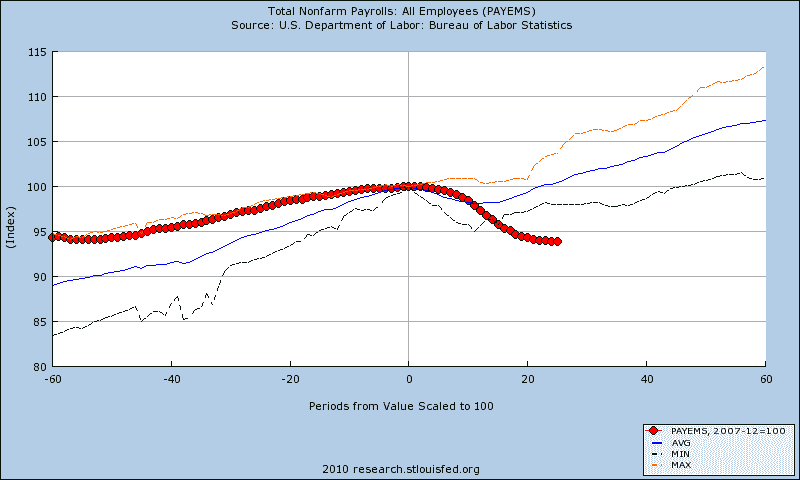
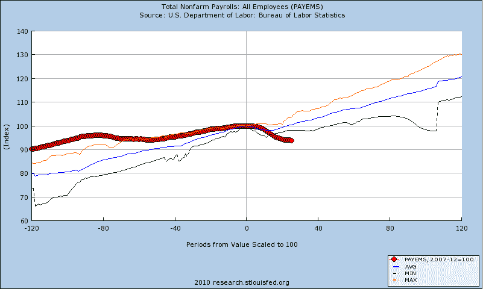

<!--yml

category: 未分类

date: 2024-05-18 17:14:56

-->

# VIX and More: 经济衰退前后非农就业人口

> 来源：[`vixandmore.blogspot.com/2010/02/nonfarm-payrolls-before-and-after.html#0001-01-01`](http://vixandmore.blogspot.com/2010/02/nonfarm-payrolls-before-and-after.html#0001-01-01)

我很高兴看到周日发布的[本周图表：对美国复苏的更广泛审视](http://vixandmore.blogspot.com/2010/02/chart-of-week-broader-look-at-us.html)引起了相当大的兴趣和讨论。虽然我一直是一个有证的[四重人格](http://en.wikipedia.org/wiki/Quadrophenia)，但说实话，如今经济中任何人都在关注的唯一一块就是就业。因此，在明天的每周[失业救济申请](http://vixandmore.blogspot.com/search/label/jobless%20claims)数据和一周后的 2 月[非农就业人口](http://vixandmore.blogspot.com/search/label/nonfarm%20payrolls)发布之际，这似乎是一个重新审视就业情况的好机会。

自从[上周的图表](http://vixandmore.blogspot.com/2010/02/chart-of-week-broader-look-at-us.html)测量了从前一个商业周期高峰 12 个月到 27 个月后的非农就业人口以来，我选择对就业和衰退进行更长时间的观察。下面的两张图表显示了自 1948 年以来，每次商业周期前五年和后十年的就业趋势数据。

请注意，在[2007 年 12 月商业周期高峰](http://www.nber.org/dec2008.pdf)之前的几年里，与历史平均水平相比，就业增长相对平坦（蓝色线条）。更重要的是，当前“复苏”期间的表现不仅与之前的经济衰退后的就业创造努力相比显得贫血，而且就业情况还没有明确的底部迹象。当前的经济环境与之前的衰退形成了鲜明对比，在那时的经济通常会在这个阶段替换所有在衰退期间失去的工作，并且相对于前一个商业周期高峰，已经处于净正面就业状态。

虽然我仍然预期就业增长将在未来几个月开始，但失业复苏持续的时间越长，经济全面复苏就越困难。

有关相关主题的更多信息，读者们可以查阅：

*[来源：圣路易斯联邦储备银行]* **披露：** *无*
