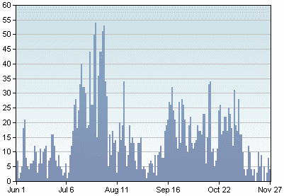

<!--yml

分类：未分类

日期：2024-05-18 18:52:46

-->

# VIX 和更多：最近没有多少恐慌或波动

> 来源：[`vixandmore.blogspot.com/2007/11/not-lot-of-fear-or-volatility-lately.html#0001-01-01`](http://vixandmore.blogspot.com/2007/11/not-lot-of-fear-or-volatility-lately.html#0001-01-01)

考虑到所有主流媒体和博客圈中的末日头条（界限似乎已经模糊...），看到如此少的新闻恐慌（夸张？）转化为市场恐慌，我有些惊讶。

从左边的图表开始，它描述了过去 180 天里，“VIX”一词在具有特定最低 Technorati 权威级别的博客文章中出现的频率([查看原始工具](http://charts.technorati.com/chart/VIX?chartdays=180&language=en&authority=a4))，几乎好像 VIX 是一个来去匆匆的想法。最近，人们谈论的都是次贷、CDO、SIV，而[利率利差](http://www.bloomberg.com/markets/rates/index.html)成了当天的记分牌。市场可能下跌了 10%，但当我写下这些文字时，VIX 在 26 个多一点，VIX 并不是这个故事的一部分。

在我持续努力区分恐慌和波动的过程中，我在这个时候转向了[VIX:SDS 比率](http://vixandmore.blogspot.com/search/label/VIX%3ASDS)来观察市场急剧下跌时恐慌是如何起伏的。这个比率的一年图表如下。VIX:SDS 比率图表的先前版本都是 6 个月的，但我认为在当前市场环境中查看它，并能够将其与二月份三月份和七月份八月份的 VIX 激增（SDS 反向 ETF 是在 6/13/06 推出的，所以不可能捕捉到从 5/12/06 到 6/13/06 的 VIX 激增期间的比例。）是很重要的。

有很多方法可以解读这张图表（当然，这需要比较一个振荡数（β约为-4.2）和一个趋势数（目标β约为-2.0）），但我一直回到的是当前读数或 10 日 SMA 与更长期的 100 日 SMA 之间的距离。在某种程度上，这隔离了 VIX 的恐慌成分的大小，在下面的图表中，它突显了与 SPX 最近下跌相比，恐慌相对较少，特别是与二月份三月份和七月份八月份的类似值相比。我不确定如何解释这一点，但我怀疑，要么市场将恢复到一个与恐慌相称的水平，要么我们可能会看到 VIX 急剧上升到 30 多，这很可能会发出短期内触底的信号。而且，与其他地方阅读的内容不同，并非所有的市场底部都需要高成交量投降，伴随着 VIX 的急剧上升。
