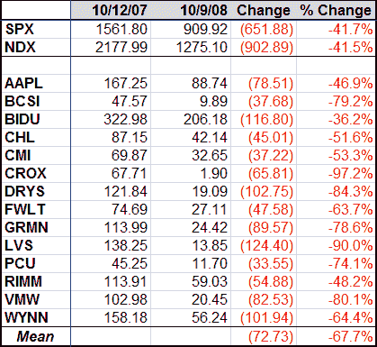
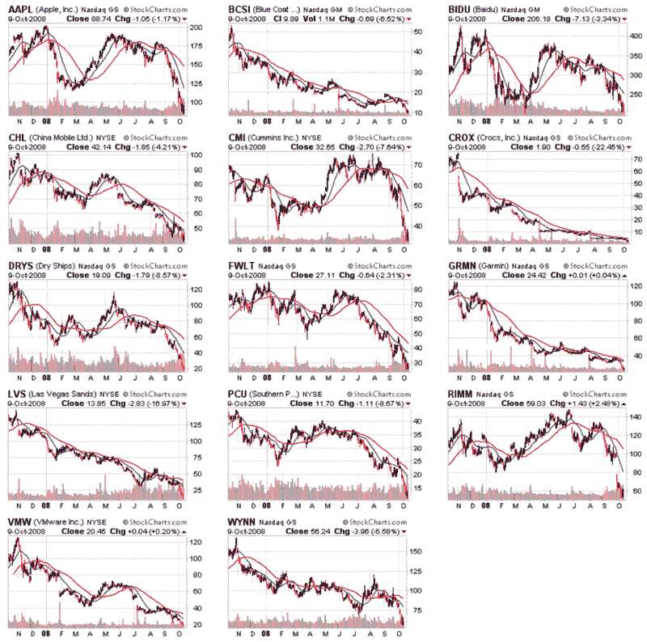

<!--yml

类别：未分类

日期：2024-05-18 18:22:03

-->

# VIX 和更多：OHFDEX 一年后

> 来源：[`vixandmore.blogspot.com/2008/10/ohfdex-one-year-later.html#0001-01-01`](http://vixandmore.blogspot.com/2008/10/ohfdex-one-year-later.html#0001-01-01)

一年前，在“[从过度成熟到脆弱？](http://vixandmore.blogspot.com/2007/10/from-overripe-to-vulnerable.html)”一文中，我介绍了一个我称之为[OHFdex](http://vixandmore.blogspot.com/search/label/OHFdex)或者过度成熟的高飞股列表，以及来自 StockCharts.com 的 14 个[CandleGlance](http://stockcharts.com/charts/indices/)图表，这些图表是给最高的高飞股的。

不言而喻，一年后的景象是相当丑陋的。

这些股票不仅一年前就过度成熟并且脆弱，而且它们正面临着被腰斩的命运。CROCS（[CROX](http://finance.yahoo.com/q?s=CROX)）一年内跌幅超过 97%，拉斯维加斯金沙集团（[LVS](http://finance.yahoo.com/q?s=lvs)）下跌了 90%，而德瑞斯 hips（[DRYS](http://finance.yahoo.com/q?s=drys)）和 VMware（[VMW](http://finance.yahoo.com/q?s=vmw)）的跌幅都超过了 80%。总的来说，14 个前股市宠儿中有 11 个跌幅超过 50%。平均跌幅为 67.7%，中位数跌幅为 69.3%。该集团表现最佳的是百度（[BIDU](http://finance.yahoo.com/q?s=bidu)），这家中国搜索引擎公司虽然下跌了 36%，而中国市场下跌了 57%。

我还为 OHFdex 的所有 14 个成员包括了为期一年的图表（再次由 StockCharts.com 提供），图表中有蓝色的 20 天 SMA 和红色的 50 天 SMA：

来源：[StockCharts](http://stockcharts.com/)

在今天崩溃的废墟中筛选，看起来是时候创建一个新的被低估股票列表，这些股票可以在接下来的的一年里繁荣。
