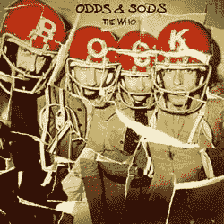

<!--yml

分类：未分类

日期：2024-05-18 18:55:16

-->

# VIX 和更多：杂项

> 来源：[`vixandmore.blogspot.com/2007/11/odds-and-sods_02.html#0001-01-01`](http://vixandmore.blogspot.com/2007/11/odds-and-sods_02.html#0001-01-01)

周五总是进行一些家务的好时机，所以这里有一些关于博客近期主题的更新：

在恐惧方面，昨天显示出了相当多的恐惧情绪，因为 VIX 的 25.3%的增加几乎是 SPX 下跌 2.6%时的两倍。尽管今天的市场在激动人心的开盘后似乎稍微稳定了一些，但 elevated fear 仍然存在。对于那些可能感兴趣的人，你总是可以在我的[恐惧与自满指数图](http://vixandmore.blogspot.com/2007/10/how-fearful-were-we-last-week.html)上查看今天的 VIX 和 SPX 的百分比变化，以做出自己的评估。

现在，由于美联储[可能已经完成了](http://www.clevelandfed.org/research/Policy/fedfunds/index.cfm)降息（参见 Mike Shedlock 的“[Is it Two and Done?](http://globaleconomicanalysis.blogspot.com/2007/11/rate-cuts-is-it-two-and-done.html)”），好消息是好消息，坏消息也是好消息的周期可能即将结束。这意味着我们可能正进入一个[罗夏测试](http://en.wikipedia.org/wiki/Rorschach_inkblot_test)周期，其中对政府数据的解释开始主要受到您对投资景观的看法的驱动，以及可能隐藏在表面之下的任何精神障碍。

在[四将](http://vixandmore.blogspot.com/2007/10/four-generals-will-tell-story.html)，[四骑士](http://www.thestreet.com/pf/funds/madmoneywrap/10361041.html)等类别中，大型科技股的领导地位继续表现良好，而[南方铜业（PCU）](http://finance.google.com/finance?q=pcu&hl=en)的业绩则有些[挣扎](http://stockcharts.com/charts/gallery.html?pcu)。然而，该集团的大新闻是[万事达卡（MA）](http://finance.google.com/finance?q=ma&hl=en)，其股价在一份[爆炸性财报](http://www.businessweek.com/investor/content/oct2007/pi20071031_548185.htm?campaign_id=yhoo)发布后飙升了 20%。万事达卡的成功很大程度上可以归功于全球范围内对塑料货币的接受程度提高，而不仅仅是美国，尽管美国的增长放缓。事实上，考虑到[零售持有者（RTH）](http://finance.google.com/finance?q=rth)ETF 自 7 月以来一直处于低迷状态，我将密切关注许多在感恩节前刚刚发布业绩的零售商。对于一些相关观点，Toro 的奔牛赛[有说服力地](http://runningofthebulls.typepad.com/toros_running_of_the_bull/2007/11/are-the-four-ho.html)认为四骑士还有很大的上涨空间，而 Chris Perruna 正在[密切关注万事达卡](http://www.chrisperruna.com/2007/11/02/mastercard-ma-charging-ahead/)。

一些快速提示给 VIXophile 爱好者：
