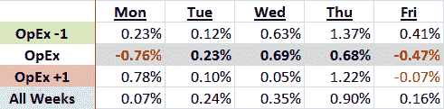

<!--yml

分类：未分类

date: 2024-05-18 17:32:33

-->

# 波动率指数 VIX: 期权到期周与 3 月至 8 月牛市的走向

> 来源：[`vixandmore.blogspot.com/2009/08/options-expiration-weeks-and-march-to.html#0001-01-01`](http://vixandmore.blogspot.com/2009/08/options-expiration-weeks-and-march-to.html#0001-01-01)

出于许多原因，[期权到期](http://vixandmore.blogspot.com/search/label/options%20expiration)周期交易起来可能非常困难。期权[到期周](http://vixandmore.blogspot.com/search/label/expiration%20week)的一个问题是，影响股价的力量这周通常与其它周不同，经常忽视现有的基本趋势，但有时会放大这些趋势。

一个经验法则是，期权到期前的一周市场大多呈现多头态势，而期权到期后的一周市场则可能偏向空头。平均来看，期权到期周的波动性较低，且方向性中性较强，与其他两周相比有所不同。

在下面的表格中，我查看了从 3 月 6 日低点以来的数据，并发现有趣的是，期权到期前的一周是三个到期周中最多的多头行情，而期权到期后的一周则紧随其后，稍有领先。期权到期周本身相对平稳，特别是与其它两周相比。

我对此的直觉解释是，期权到期周的股票波动更可能是随机的，并与基本趋势不同步。因此，在期权到期周，股票在牛市中通常表现不佳，在熊市中表现超群。

对于一些相关文章，可以尝试搜索：
