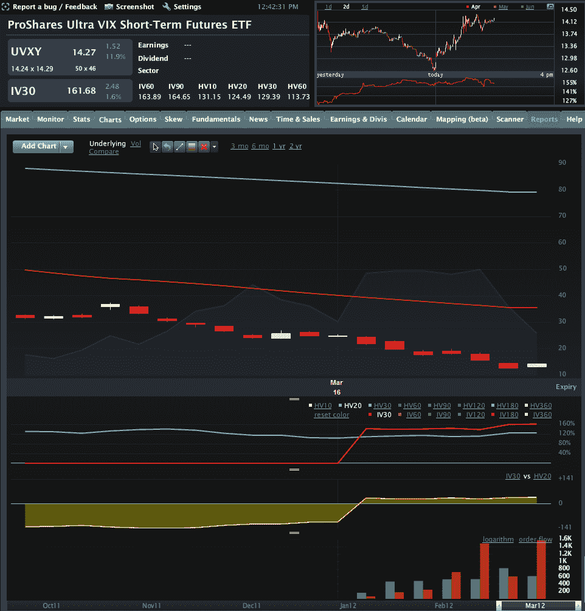

<!--yml

category: 未分类

date: 2024-05-18 16:34:56

-->

# VIX and More: Options on UVXY and SVXY Open Up New VIX ETP Trading Approaches

> 来源：[`vixandmore.blogspot.com/2012/03/options-on-uvxy-and-svxy-open-up-new.html#0001-01-01`](http://vixandmore.blogspot.com/2012/03/options-on-uvxy-and-svxy-open-up-new.html#0001-01-01)

不管我是否觉得有用的鞭策那匹被称为 VelocityShares Daily 2x VIX Short-Term ETN ([TVIX](http://vixandmore.blogspot.com/search/label/TVIX))的受伤马，投资者和媒体似乎坚持认为，这个+2x [VIX 期货](http://vixandmore.blogspot.com/search/label/VIX%20futures) ETN 的疯狂故事现在还保持在首页。

尽管 TVIX 的故事确实引人入胜（更多细节请查看下面的链接），但我担心它上周可能排挤掉了一个更有用的进展，这个进展被严重忽视了，那就是两个重要的[VIX ETF](http://vixandmore.blogspot.com/search/label/VIX%20ETF)上期权的推出：

+   ProShares Ultra VIX Short-Term Futures ETF ([UVXY](http://vixandmore.blogspot.com/search/label/UVXY))

+   ProShares Short VIX Short-Term Futures ETF ([SVXY](http://vixandmore.blogspot.com/search/label/SVXY))

首先，请注意，这两个产品是交易所交易*基金*而不是交易所交易*票据*，这意味着期权批准起来要容易得多。尽管它们更著名的交易所交易票据（ETN）同行 TVIX 和[XIV](http://vixandmore.blogspot.com/search/label/XIV)吸引了大多数头条新闻，但期权的增加意味着交易员现在在 UVXY 和 SVXY 上有了更多的策略和战术上的灵活性。

过去当我提到 VIX 交易所交易产品（ETP）的期权对其长期成功至关重要时，我遇到了一些（电子）冷漠的眼神。这部分反映了这样一个事实：许多人被 VIX ETP 的潜力所吸引，在短时间内（关于这一点在[交易员发展阶段模型与从股票到期权的跳跃](http://vixandmore.blogspot.com/2009/09/trader-stage-development-model-and-jump.html)中有更多讨论）通过杠杆交易获得巨大利润。然而，与大多数专业期权交易员交谈，杠杆很少是他们关注期权交易的原因之一。事实上，专业人士更可能提到期权的两个关键优势：他们的灵活性和构建定义[风险](http://vixandmore.blogspot.com/search/label/risk)（或有限风险）交易的能力。

这让我想到了 UVXY 和 SVXY 的期权。截至昨天收盘，UVXY 本季度下跌了 83%，人们可能会认为定义风险的头寸——无论多头还是空头——在构建未来交易结构中都是一个关键因素。由于目前 VIX 期货存在巨大的[正向市场](http://vixandmore.blogspot.com/search/label/contango)和负[滚动收益率](http://vixandmore.blogspot.com/search/label/roll%20yield)，无论哪个方向的方向性投注都涉及巨大风险。对于空头来说，这意味着通过购买 UVXY 看涨期权可以将空头的风险限定住。对于多头来说，这意味着通过购买看跌期权也可以限制多头的风险。

还有其他实现定义风险交易的方法，尤其是使用[垂直信用价差](http://vixandmore.blogspot.com/search/label/vertical%20credit%20spread)和[垂直债务价差](http://vixandmore.blogspot.com/search/label/vertical%20debit%20spread)，其中盈亏限于行权价之间的距离。交易员还可以简单地买入看涨期权和看跌期权来实施方向性想法，知道他们的最大损失将限于购买价格。

在难以借入股票的情况下——某些 VIX ETP 经常出现这种情况——交易员还可以使用期权来创建一个[合成](http://vixandmore.blogspot.com/search/label/synthetic)头寸。例如，一份看跌期权加上一份看涨期权的空头相当于一个合成空头，因此如果无法借到股票，合成头寸可能是一个极好的替代品，具有与标准空头头寸相同的盈亏潜力，但通常需要的交易资本要少得多。

请注意，UVXY 和 SVXY 期权的市场只有一周大，目前流动性并不强。另一方面，成交量正在迅速上升（请看下面 UVXY 期权成交量的图表等），期权产品的灵活性和风险控制使得这些产品具有吸引力，尤其是在应用于高度波动的产品如 UVXY 和 SVXY 时。

相关文章：

*****

****来源：**** LivevolPro.com*

****披露：**** 撰写本文时，持有 XIV 和 SVXY 多头头寸，持有 TVIX 和 UVXY 空头头寸；Livevol 是 VIX 和 More 的广告商*
