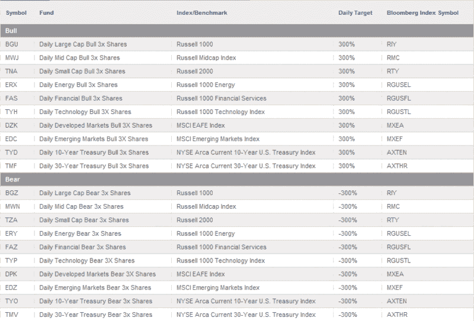

<!--yml

分类：未分类

日期：2024-05-18 17:45:58

-->

# VIX and More: Options on the Direxion Leveraged ETFs

> 来源：[`vixandmore.blogspot.com/2009/05/options-on-direxion-leveraged-etfs.html#0001-01-01`](http://vixandmore.blogspot.com/2009/05/options-on-direxion-leveraged-etfs.html#0001-01-01)

上次我关注[Direxion](http://vixandmore.blogspot.com/search/label/Direxion) [三倍 ETFs](http://vixandmore.blogspot.com/search/label/triple%20ETFs)是在 2 月初，当时我询问了[为什么最近 Direxion ETFs 的成交量如此之少？](http://vixandmore.blogspot.com/2009/02/why-is-there-so-little-volume-in-most.html)。虽然那个问题没有得到直接回答，但我注意到在随后的几周里，两个最波动性大的新配对 ETF 的成交量大幅上升，分别是新兴市场([EDC](http://vixandmore.blogspot.com/search/label/EDC)和[EDZ](http://vixandmore.blogspot.com/search/label/EDZ))和科技([TYH](http://vixandmore.blogspot.com/search/label/TYH)和[TYP](http://vixandmore.blogspot.com/search/label/TYP))ETF。

2 月底，Direxion 又推出了一对三倍 ETF 配对，中小盘股牛市([MWJ](http://vixandmore.blogspot.com/search/label/MWJ))和中小盘股熊市([MWN](http://vixandmore.blogspot.com/search/label/MWN))ETF。4 月中旬，Direxion 在三倍 ETF 组合中增加了些债券 ETF，包括 30 年美国国债牛市([TMF](http://vixandmore.blogspot.com/search/label/TMF))和熊市([TMV](http://vixandmore.blogspot.com/search/label/TMV))配对，以及 10 年美国国债牛市([TYD](http://vixandmore.blogspot.com/search/label/TYD))和熊市([TYO](http://vixandmore.blogspot.com/search/label/TYO))配对。

有关目前 Direxion 三倍 ETF 组合的详细信息，请查看下面的图表，或者访问[Direxion Shares ETF 网站](http://www.direxionshares.com/etfs)。

除了扩大可用三倍 ETF 的范围外，Direxion 还试图通过给每个 ETF 名称添加“Daily”前缀来解决这些 ETF 跟踪误差的批评，以强调这些 ETF 是每日重新平衡，并且只尝试匹配日常波动，而不是长期跟踪目标指数。有趣的是，任何访问 Direxion Shares 主页的人都会首先看到，“Direxion Shares 并不适合每个人。它们适合你吗？”以及一个[链接](http://www.direxionshares.com/education_faq.html#1)，试图劝阻他们所说的保守投资者。

三倍交易所交易基金（ETFs）的一个具有有趣战略含义的方面是期权的可用性。截至本周，除基于 EAFE 指数的 ETF 外，所有 Direxion 三倍 ETF 都提供了期权，[DZK](http://vixandmore.blogspot.com/search/label/DZK)和[DPK](http://vixandmore.blogspot.com/search/label/DPK)除外。

不必说，能像三倍 ETF 期权那样迅速变动的交易工具非常少见，但對於有经验的期权交易员来说，这些期权提供了很大的潜在回报，当然也伴随着相应的风险。

**[图表：Direxion Shares]**

****披露****：在撰写本文时，持有 TYP 多头仓位。
