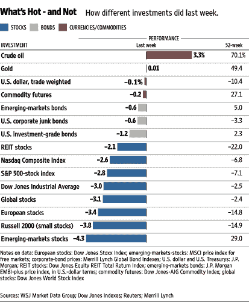

<!--yml

类别：未分类

date: 2024-05-18 18:41:19

-->

# VIX 和更多：上周的其他视角

> 来源：[`vixandmore.blogspot.com/2008/03/other-perspectives-on-last-week.html#0001-01-01`](http://vixandmore.blogspot.com/2008/03/other-perspectives-on-last-week.html#0001-01-01)

家庭和气象因素的汇合使我上周只能间歇性地在德克萨斯州乡村上网。本周我正在全力运行，但由于上周大部分时间我脱离了信息网格，我将依靠那些联网的人提供回顾。

首先，从严格的数字角度来看，上周几个主要指数的重要支撑位被突破，而买入/卖出比率数据[处于极端水平](http://vixandmore.blogspot.com/2008/03/put-to-call-data-at-extreme-levels.html)整个星期。与买入/卖出数据相比，波动指数在整个星期都显得缓慢且不引人注目，VIX 全周上涨 0.95（3.6%）至 27.49，VWSI 升至+1。

正如《华尔街日报》的“热门或不在”图表所示，上周几乎只有石油是赢家的投资选择，而一个人的股权投资越小（市值）且分布越远，它们的业绩表现就越差。

四位顶级博主对上周的行动做了很好的总结：

巴里·里索尔特（Barry Ritholtz）在[大图景](http://bigpicture.typepad.com/)上，他的[链接节](http://bigpicture.typepad.com/comments/2008/03/leapyear-linkfe.html)中，他调查了各种事实和观点，重点关注宏观经济和基本面新闻。 Babak 在[交易者的叙述](http://www.tradersnarrative.com/)上提供了他上周的[情绪概述](http://www.tradersnarrative.com/sentiment-overview-week-of-march-7th-2008-1561.html)。 Declan Fallond（[Fallond 股票选择](http://blog.fallondpicks.com/)）通过一些股票图表专家的视角，提供了上周的回顾——附有他自己的评论。[最后但并非最不重要的是](http://www.billcara.com/)，比尔·卡 ara（Bill Cara）像往常一样，提供了本周的[详尽图表和评论](http://www.billcara.com/archives/2008/03/week_in_review_10_20080309.html#more)——非常适合那些希望按部门、地区和资产类别切割市场的人。

最后，我这里不能不推荐一款昨晚我尝试过的性价比高的红葡萄酒混合品种：在 Trader Joe’s 售价为 6.99 美元的[Novella Synergy](http://www.eosvintage.com/winenotes/Nov-04%20Synergy.pdf)，这是来自[EOS Winery](http://www.eosvintage.com/)位于加利福尼亚州 Paso Robles 的葡萄酒。这款混合葡萄酒每年都会有所变化，但我尝试的 2005 年版本由 46%的小西拉，33%的赤霞珠，16%的桑娇维塞和 5%的小味多组成。虽然小西拉和赤霞珠的结合听起来可能会制作出一种浓重、压倒性的葡萄酒，但这款红酒比我所预期的要精致得多，适合日常饮用。它既可以单独饮用，也适合搭配食物，对于那些陷入“再次饮用同一种葡萄品种”的固定模式的人来说，这款葡萄酒是一个极好的选择。
