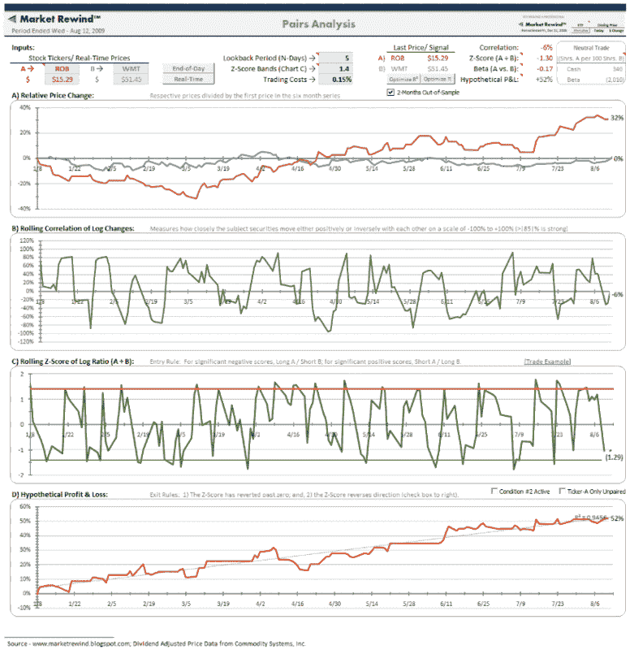

<!--yml

类别：未分类

日期：2024-05-18 17:33:50

-->

# VIX and More: 使用 ROB 的对冲交易

> 来源：[`vixandmore.blogspot.com/2009/08/pairs-trading-with-rob.html#0001-01-01`](http://vixandmore.blogspot.com/2009/08/pairs-trading-with-rob.html#0001-01-01)

虽然我从未为*VIX and More*写过任何使命声明或目标，但我的目标始终是向投资领域引入新鲜思想、新主题和原创图表，这个领域往往被同样的陈词滥调所充斥。

理想情况下，我希望能给读者提供一系列他们可以深思熟虑和使用的想法和概念，以将新思维融入他们的交易中。

我从未对交易博客感兴趣，但有时我应该更好地努力，将深思熟虑与交易相结合。昨天的[Hermès vs. Wal-Mart](http://vixandmore.blogspot.com/2009/08/hermes-vs-wal-mart.html)就是一个例子。这篇文章引起了不少反馈，包括一些关于可能的零售 ETF 和个别股票的对冲交易方法的讨论。

下面的图表是对昨天的帖子中讨论的 Claymore/Robb Report 全球奢侈品指数 ETF ([ROB](http://vixandmore.blogspot.com/search/label/ROB)) 与 Wal-Mart ([WMT](http://vixandmore.blogspot.com/search/label/WMT)) 比率的一种改编，并融入了[ETF Rewind](http://etfrewind.blogspot.com/)中的一些对冲交易工具，这是一个强大的 Excel 表格工具和姊妹博客，是 Jeff Pietsch 受欢迎的[Market Rewind](http://marketrewind.blogspot.com/)博客的姊妹网站。

图表显示了使用 ROB 和 WMT 的市场中性对冲交易方法的潜力，该方法包括一个 4 天的回溯期，并产生一个平滑的理想利润和损失曲线。 [[点击查看完整大小的原始图表](http://www.etfrewind.com/overview/ROB%20Pairs/ROBWMT.png)]

对冲交易或对分析 ETFs 的优秀 Excel 电子表格感兴趣的读者，建议查看[ETF Rewind](http://etfrewind.blogspot.com/)，该服务可免费试用三天。

*[来源：ETF Rewind]*

**披露：** 我每天都会使用 ETF Rewind，对其非常满意，现在提供包含 VIX and More、ETF Rewind 和[Quantifiable Edges](http://quantifiableedges.blogspot.com/)的特殊年度订阅捆绑服务，称为*[博客三重奏](http://vixandmoresubscriber.blogspot.com/2009/03/announcing-blogger-triple-play.html)*。
