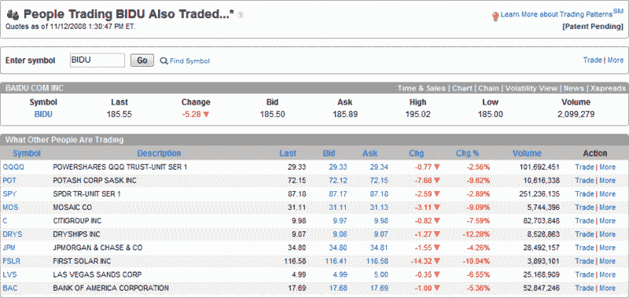

<!--yml

类别：未分类

日期：2024-05-18 18:16:38

-->

# VIX 和更多：交易 BIDU 的人还交易了…

> 来源：[`vixandmore.blogspot.com/2008/11/people-trading-bidu-also-traded.html#0001-01-01`](http://vixandmore.blogspot.com/2008/11/people-trading-bidu-also-traded.html#0001-01-01)

回到 2007 年 9 月，我开始间歇性地发布来自 optionsXpress [交易模式](http://vixandmore.blogspot.com/search/label/Trading%20Patterns)功能的快照，并选择突出高度投机的中文互联网搜索公司，百度 ([BIDU](http://vixandmore.blogspot.com/search/label/BIDU)), 当时交易价格为 299，作为我的实验对象。在七个月的时间里，我两次更新了在 optionsXpress 上交易 BIDU 的人还在交易什么，当时 BIDU [在 2007 年 10 月 30 日为 380](http://vixandmore.blogspot.com/2007/10/update-on-people-trading-bidu-also.html) 和在 [2008 年 4 月 22 日为 350](http://vixandmore.blogspot.com/2008/04/bidu-speculators.html)。

我刚刚捕捉到了最新的交易模式更新，结果显示，当前交易于 BIDU（目前为 185）的交易者仍然在农业、金融、航运、太阳能和赌场等最波动的股票中活跃。前十名单上的股票：Potash ([POT](http://vixandmore.blogspot.com/search/label/POT)), Mosaic ([MOS](http://vixandmore.blogspot.com/search/label/MOS)), Citigroup ([C](http://vixandmore.blogspot.com/search/label/C)), JPMorgan Chase ([JPM](http://vixandmore.blogspot.com/search/label/JPM)), Bank of America ([BAC](http://vixandmore.blogspot.com/search/label/BAC)), DryShips ([DRYS](http://vixandmore.blogspot.com/search/label/DRYS)), First Solar ([FSLR](http://vixandmore.blogspot.com/search/label/FSLR)), 和拉斯维加斯金沙 ([LVS](http://vixandmore.blogspot.com/search/label/LVS)). 列表中还有两个 ETF，[QQQQ](http://vixandmore.blogspot.com/search/label/QQQQ) 和 [SPY](http://vixandmore.blogspot.com/search/label/SPY). 要么 optionsXpress 客户在空头方面已经大扫除，要么他们有点早参加牛市派对。

来源：optionsXpress
