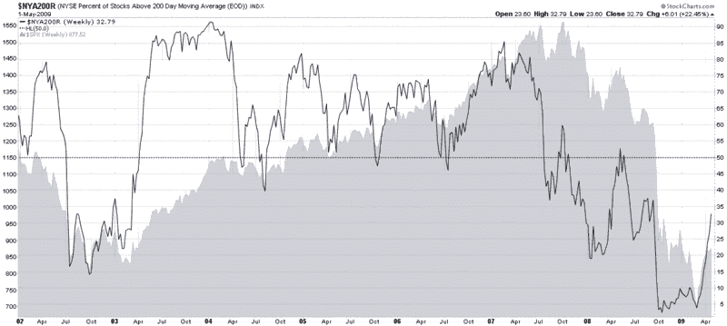

<!--yml

分类：未分类

date: 2024-05-18 17:49:03

-->

# 波动指数（VIX）与更多：NYSE 股票 200 天 SMA 以上百分比

> 来源：[`vixandmore.blogspot.com/2009/05/percentage-of-nyse-stocks-above-200-day.html#0001-01-01`](http://vixandmore.blogspot.com/2009/05/percentage-of-nyse-stocks-above-200-day.html#0001-01-01)

虽然它与昨天[的本周图表](http://vixandmore.blogspot.com/search/label/chart%20of%20the%20week)（NYSE 股票 50 天简单移动平均以上百分比）的结构相似，但是 NYSE 股票[200 天移动平均以上百分比](http://vixandmore.blogspot.com/search/label/200%20day%20SMA)的图表与 50 天版本看起来大不相同，通常受到的解释也大不相同。

下面的图表是自 2002 年以来股票交易量超过 200 天简单移动平均的百分比周图表。正如图表所示，200 天移动平均很好地捕捉到了长期趋势的力量。例如，在 2003-2007 年的牛市中，50％的回调代表了优秀的买入机会。此外，当 NYSE 股票 200 天 SMA 以上的百分比在 2007 年 10 月未能超过 60％的水平时，这应该被视为市场宽度疲弱和牛市行情危险的信号。

由于 200 个交易日大约涵盖了 9 个半月的交易时间，200 天百分比数据的大幅波动往往明显落后于市场。因此，在解读下面的图表时，应关注至少 30％的波动，这将整体百分比提高到 60 水平以上或降低到 40 水平以下。将这种解读应用到下面的图表中，当 NYSE 股票的 200 天简单移动平均（SMA）超过 60 时，当前的牛市行情应被视为一个牛市。

来源：[StockCharts](http://vixandmore.blogspot.com/2009/05/percentage-of-nyse-stocks-above-200-day.html#0001-01-01)
