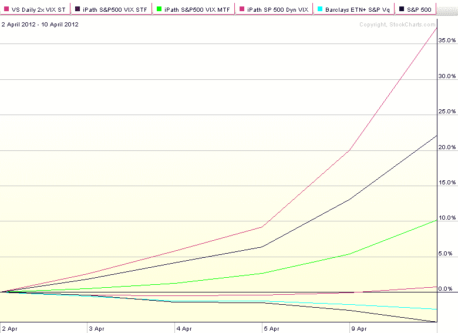
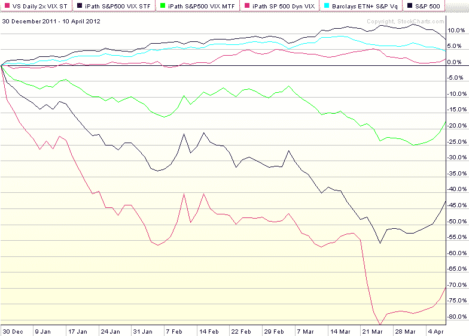

<!--yml

category: 未分类

date: 2024-05-18 16:33:13

-->

# VIX and More: Performance of VIX ETP Hedges in Current Selloff

> 来源：[`vixandmore.blogspot.com/2012/04/performance-of-vix-etp-hedges-in.html#0001-01-01`](http://vixandmore.blogspot.com/2012/04/performance-of-vix-etp-hedges-in.html#0001-01-01)

仅在一周前，我讨论了 31 只 VIX 和基于波动率的交易所交易产品在[2012 年第一季度 VIX ETP 回报](http://vixandmore.blogspot.com/2012/04/vix-etp-returns-for-q1-2012.html)中的表现，仅在一个月前，我详细研究了两种[VIX ETPs](http://vixandmore.blogspot.com/search/label/VIX%20ETN)，[VQT](http://vixandmore.blogspot.com/search/label/VQT)和[XVZ](http://vixandmore.blogspot.com/search/label/XVZ)的运作情况，在[动态 VIX ETPs 作为长期对冲](http://vixandmore.blogspot.com/2012/03/dynamic-vix-etps-at-long-term-hedges.html)中。然而，当股票下跌而波动率上升时，哪种 VIX ETP 对冲效果最好？

答案并不那么简单，除非你知道何时开始波动性上升，它会上涨到多高以及达到那个水平需要多长时间。即使如此，了解[VIX 期货](http://vixandmore.blogspot.com/search/label/VIX%20futures)的[期限结构](http://vixandmore.blogspot.com/search/label/term%20structure)在此过程中发生了什么也会很有帮助。此外，还有可能会限制大多数投资者选择的流动性约束，最多只有半打或更少的选择。

话虽如此，当前的抛售可以用来强调一些重要的启发式方法和替代方法。例如，下面的第一个图表说明了自 4 月 2 日收盘以来的五个代表性和相对流动性较好的 VIX ETPs（由于流动性的原因，[TVIZ](http://vixandmore.blogspot.com/search/label/TVIZ)被排除在外；其在此期间的表现与[VXX](http://vixandmore.blogspot.com/search/label/VXX)类似）的表现，这些产品可以用作对冲。大多数情况下，表现趋势与[第一季度观察到的](http://vixandmore.blogspot.com/2012/04/vix-etp-returns-for-q1-2012.html)相反。

在过去五个交易日内，三种固定的 VIX ETP 表现出色。借助+2x 的杠杆和短期（加权平均一个月）的成熟度，[TVIX](http://vixandmore.blogspot.com/search/label/TVIX)（红线）在该组中脱颖而出。在下跌期间表现第二好的是 VXX（蓝线），一个+1x 的短期产品。+1x 中期（加权平均一个月）的成熟度[VXZ](http://vixandmore.blogspot.com/search/label/VXZ)（绿线）ETP 也是表现强劲，当然值得一枚铜牌。所有这三个对冲基金在过去五个交易日内都上涨了超过 10%，而标普 500 指数（黑线）下跌了 4.3%。与他们的固定分配同行形成鲜明对比的是，在下跌期间，这两个动态分配 VIX ETP 都围绕不变的线路徘徊，[XVZ](http://vixandmore.blogspot.com/search/label/XVZ)（紫线）在今天的轻微反弹后小幅上涨，而[VQT](http://vixandmore.blogspot.com/search/label/VQT)（天蓝色线）在同一时期亏损。

显然，任何在 4 月 2 日购买 TVIX（或 VXX 或 VXZ）的人都坐在不错的利润上，但第二张图表，从今年初开始跟踪相同 ETP 的表现，简洁地概述了大局的困境。简而言之，最敏感的对冲（TVIX、VXX 等）是那些具有固定分配的对冲，最容易因等待 VIX 急速上升而遭受损失[contango](http://vixandmore.blogspot.com/search/label/contango)和负[滚动收益率](http://vixandmore.blogspot.com/search/label/roll%20yield)。另一方面，动态分配 VIX ETP 被调整以最小化因 contango 和负滚动收益率而造成的损失，因此可以长时间放置，但它们的动态分配规则中存在足够的延迟时间，以至于它们在提供对突然且短暂 VIX 急速上升的保护方面作用不大，而在像 2011 年 8 月至 9 月欧洲主权债务危机高峰期间这样的长期波动期间，更好地保护投资组合。

所以……如果你知道烟花什么时候开始，TVIX 和 VXX 作为长期股票组合的波动性对冲是 excellent choices。如果时间表不确定（这往往是情况）并且目标是保护 against a period of extended high volatility,那么 VXZ 和 VQT 可能是更有吸引力的替代品。

相关文章：

来源：[StockCharts.com](http://vixandmore.blogspot.com/search/label/source)

***披露(s):*** *在撰写本文时持有 XVZ，同时做空 VIX、VXX 和 TVIX*
