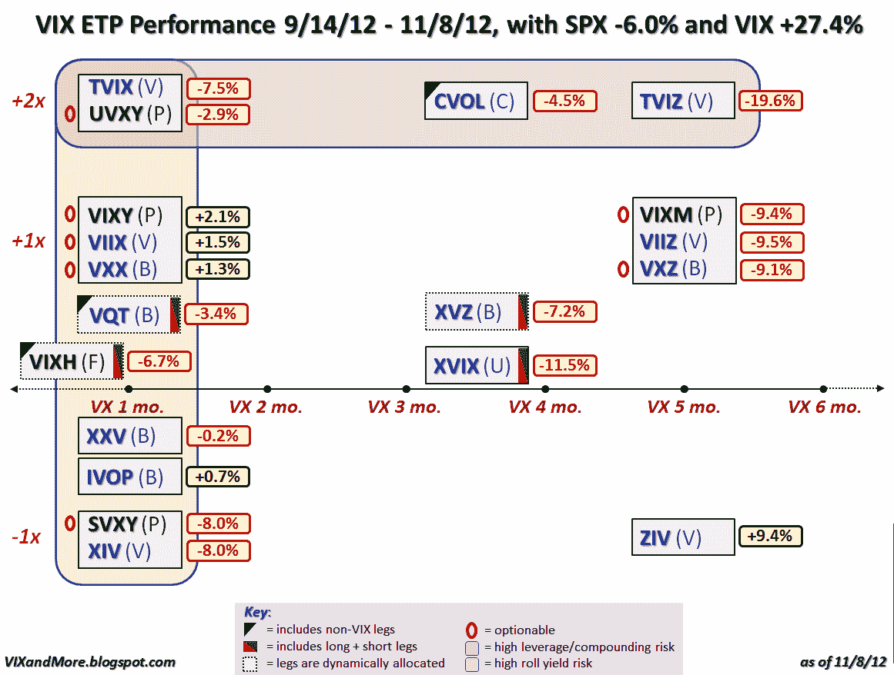

<!--yml

分类：未分类

日期：2024-05-18 16:23:14

-->

# VIX 和更多：当前回调期间 VIX ETP 的表现

> 来源：[`vixandmore.blogspot.com/2012/11/performance-of-vix-etps-during-current.html#0001-01-01`](http://vixandmore.blogspot.com/2012/11/performance-of-vix-etps-during-current.html#0001-01-01)

在本空间讨论的所有问题中，毫无疑问，最能吸引大多数读者想象力的是基于 VIX 的交易所交易产品主题[VIX-based exchange-traded products](http://vixandmore.blogspot.com/search/label/VIX%20ETN)。我收到了更多关于这些产品构建方式、它们如何响应[VIX 期货](http://vixandmore.blogspot.com/search/label/VIX%20futures)的[期限结构](http://vixandmore.blogspot.com/search/label/term%20structure)、影响表现的因素等方面的提问。

出于这些原因，我认为更新我的 VIX ETP 景观图可能是有益的，并包括从 9 月 14 日 SPX 收盘高点 1465 到今天收盘的 1377 的 SPX 表现数据。在那段时间里，SPX 收盘价下跌了 6.0%，而 VIX 在同一时期飙升了 27.4%。

那么，在市场抛售时，VIX ETP 的表现如何呢？

在查看下面的图表时，你首先可能注意到的是，在这次抛售中，只有 5 个 VIX ETP 实现了盈利。实际上，这些 VIX ETP 的平均表现令人失望，为-4.9%，而中位数回报为-6.7%。更有趣的是，反向波动率产品实际上超过了它们的长期波动率对应产品，并且表现最好的是所有产品中的 VelocityShares 每日反向 VIX 中期 ETN ([ZIV](http://vixandmore.blogspot.com/search/label/ZIV))。

除了静态分配的长期和短期波动率 ETP 之外，还有三个使用基于规则的公式动态分配持仓量和类型的长期波动率敞口的产品：[VQT](http://vixandmore.blogspot.com/search/label/VQT)，[XVZ](http://vixandmore.blogspot.com/search/label/XVZ)和[VIXH](http://vixandmore.blogspot.com/search/label/VIXH)。在这次抛售中，这三个产品都没有实现盈利，而表现最好的 VQT 也亏损了 3.4%。

我之前在 4 月 3 日将业绩数据叠加到这个相同的 VIX 景观图上，在[2012 年第一季度 VIX ETP 回报](http://vixandmore.blogspot.com/2012/04/vix-etp-returns-for-q1-2012.html)一文中，当时 SPX 在那个季度上涨了 12.0%，而 VIX 下跌了 33.8%。注意在那个看涨的第一季度和过去八周的卖盘期间，只有两个 VIX ETP 实现了上涨：ZIV 和[IVOP](http://vixandmore.blogspot.com/search/label/IVOP)。如果有人想知道为什么我从不提及 IVOP，首先它在过去一个月里只交易了三天，其次，它的参与度只有 0.13，这意味着实质上只有 13%的资产投资于基础指数，其余的留在现金中。至于 ZIV，我已经详尽地讨论过它，包括在一篇特色文章[ZIV 被不公正地忽视](http://vixandmore.blogspot.com/2012/01/ziv-undeservedly-neglected.html)中，那是今年 1 月的时候。

现在既然 VIXH 已经被加入到 VIX ETP 的组合中，我将努力在未来更频繁地更新一些或所有 VIX ETP 产品线的业绩情况。

与此同时，对于那些正在寻找为什么一些 VIX ETP 在各种市场环境中表现优于其同行的原因的人们，下面的链接是开始你研究的一个极好的起点。

相关文章：

***来源：雅虎***

***披露：*** *在撰写本文时持有 ZIV 和 XVZ*
