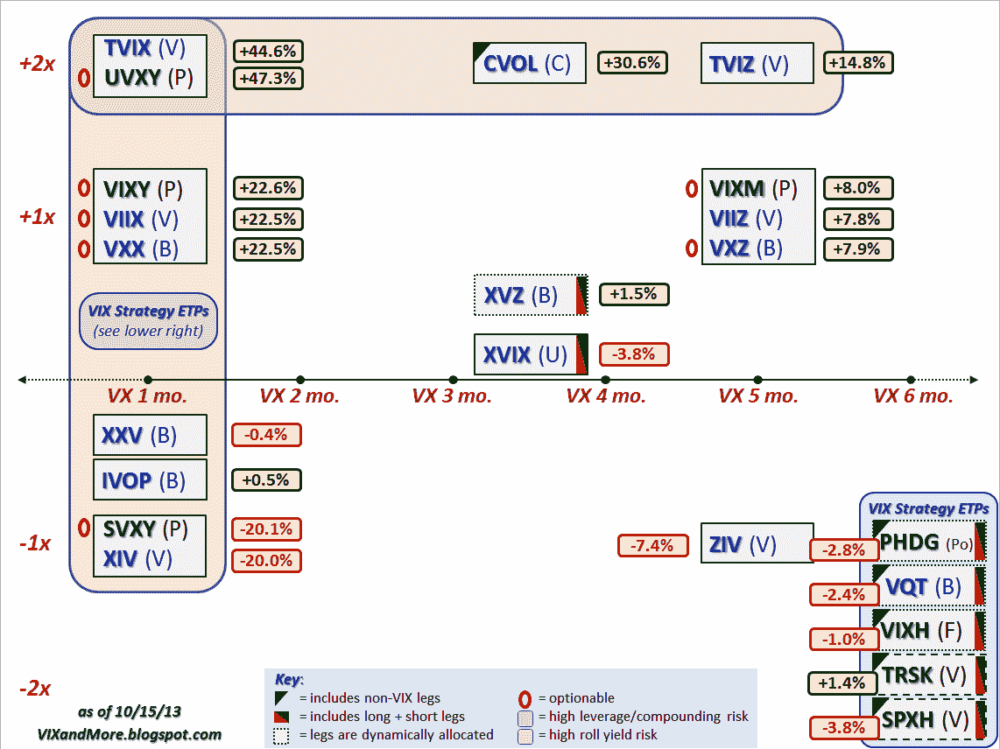

<!--yml

类别：未分类

日期：2024-05-18 16:12:52

-->

# VIX 和更多：近期债务上限危机期间 VIX ETP 的表现

> 来源：[`vixandmore.blogspot.com/2013/10/performance-of-vix-etps-during-recent.html#0001-01-01`](http://vixandmore.blogspot.com/2013/10/performance-of-vix-etps-during-recent.html#0001-01-01)

自 2010 年第一波[VIX ETPs](http://vixandmore.blogspot.com/search/label/VIX%20ETN)涌入市场以来，我一直定期在用一个网格图上绘制所有这些产品，该网格图的 y 轴用于表示杠杆，x 轴用于表示目标到期日。虽然最初的目的是为了突出[滚动收益率](http://vixandmore.blogspot.com/search/label/roll%20yield)风险和杠杆/复合风险，但随着时间的推移，我无法抗拒在图中指出哪些 ETP 是可期权化的，哪些具有长短腿，哪些长短腿是动态分配的，哪些包含非 VIX 成分等。换句话说，我屈服于自己不断尝试在一张幻灯片上讲述整个故事的需求，这无疑部分是因为我见过太多由咨询团队制作的 80 页的演示文稿…

话说回来，今天我对我的图表描述（“指南”）的 VIX ETP 宇宙的迭代有点妥协。这种妥协部分是因为波动率产品中结合了长短腿并动态分配这些腿的产品的激增。这些产品中第一个上市的是巴克莱 ETN+ S&P VEQTOR ETN（[VQT](http://vixandmore.blogspot.com/search/label/VQT)），于 2010 年 8 月 31 日推出，随后是 2012 年 8 月 29 日推出的 First Trust CBOE S&P 500 Tail Hedge Fund ETF（[VIXH](http://vixandmore.blogspot.com/search/label/VIXH)）和 2012 年 12 月 6 日推出的 PowerShares S&P 500Downside Hedged Portfolio（[PHDG](http://vixandmore.blogspot.com/search/label/PHDG))。今年，当 VelocityShares 推出 Tail Risk Hedged Large Cap ETF（[TRSK](http://vixandmore.blogspot.com/search/label/TRSK)）和 Volatility Hedged Large Cap ETF（[SPXH](http://vixandmore.blogspot.com/search/label/TRSK)）时，该领域变得更加拥挤，这两只基金均于 2013 年 6 月 24 日推出。

与其将这些五个相似产品挤在同一个狭小的空间里，我将它们从网格中分离出来，并为它们各自分配了一个“VIX 策略 ETP”的盒子。由于 VIXH 和 PHDG 现在有了一定数量的历史数据可以分析，我已经对这些产品说了很多，并且不久的将来我还会继续说更多。TRSK 和 SPXH 在利用波动率产品进行对冲方面采取了完全不同的方法，我将在不久的将来专门写一篇关于这些产品的文章。

与此同时，下面的图表显示了从 9 月 20 日（当时 VIX 收于 13.12）到 10 月 8 日（当时 VIX 收于 20.34）所有 VIX 和波动性 ETP 的表现，在此期间 VIX 飙升了 55%。正如图表所示，在危机期间，杠杆越高、期限越短，VIX ETP 的表现越好。VIX 策略 ETP 的表现参差不齐，这段时间只有 TRSK 实现了增长。另一个传统的对冲偏好，XVZ，也实现了增长。

**来源：[CBOE, Yahoo, VIX and More]**

这些对冲的关键是时机。正如过去在这里多次提到的，危机中的表现最好的通常是那些因滚动收益和/或在 VIX 没有飙升时复合而价格衰减严重的。将下面图表中的赢家和输家与[2012 年 VIX ETP 表现](http://vixandmore.blogspot.com/2013/01/vix-etp-performance-in-2012.html)中记录的赢家和输家进行比较，可以了解到在一段延长的时间内持有投机性看涨波动性头寸以及更具动态的对冲头寸可能会有多昂贵。底线是，几乎不可能创建一个在 VIX 飙升和波动性或未来波动性预期低于平均水平时表现良好的 VIX ETP。

这并不是说，时机长短波动性头寸的操作是不可能的，以便利用波动性的增加和减少，只是大多数买入并持有情景长期来看有负面预期，而时机波动性市场可能比时机股票市场更困难。

底线是，如果你认为民主党和共和党可能会在 1 月 15 日的政府资金截止日或 2 月 7 日的再次提高债务上限截止日上遇到一些困难，那么不用再看其他地方，上面的图表就能给你一些关于如何交易这些事件的想法。

相关文章：

***披露：*** *无*
