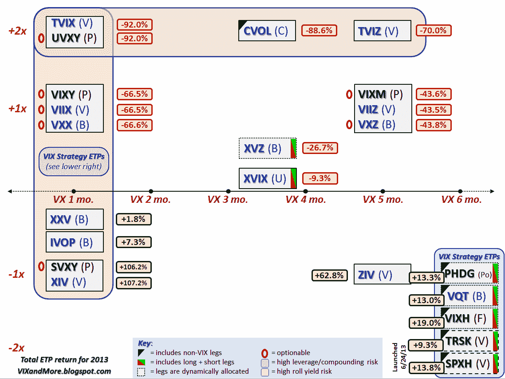

<!--yml

分类：未分类

日期：2024-05-18 16:11:32

-->

# VIX and More: 2013 年 VIX ETP 的表现

> 来源：[`vixandmore.blogspot.com/2014/01/performance-of-vix-etps-in-2013.html#0001-01-01`](http://vixandmore.blogspot.com/2014/01/performance-of-vix-etps-in-2013.html#0001-01-01)

许多读者要求我回顾一下根据我多年来一直在发布的杠杆/到期网格，2013 年[VIX ETP](http://vixandmore.blogspot.com/search/label/VIX%20ETN)的表现。

下面的图表对长期读者来说应该很熟悉，它衡量了 2013 年所有 VIX 和波动性 ETP 的表现，包括股息。（两个例外是[TRSK](http://vixandmore.blogspot.com/search/label/TRSK)和[SPXH](http://vixandmore.blogspot.com/search/label/SPXH)，其数据可以追溯到 2013 年 6 月 24 日，因此，该日的收盘价被视为 2013 年的开盘价。）这次我将避免发表大多数编辑评论，但指出这些数据与我曾在[2012 年 VIX ETP 表现](http://vixandmore.blogspot.com/2013/10/performance-of-vix-etps-during-recent.html)中呈现的内容非常相似。值得注意的是，仅仅因为 2012 年和 2013 年有类似的数字，并不意味着这些模式会定期重复。例如，在[最近债务上限危机中 VIX ETP 的表现](http://vixandmore.blogspot.com/2013/10/performance-of-vix-etps-during-recent.html)中，我呈现了一套非常不同的数据，波动性学习的学者也应该密切关注这些数据。

*[source(s): CBOE, Yahoo, VIX and More]*

对于各种 VIX ETP 表现驱动因素的更详细讨论，以及更多表现数据和评论，下面的链接应该是一个极好的起点。

相关文章：

***披露(s):*** *无*
