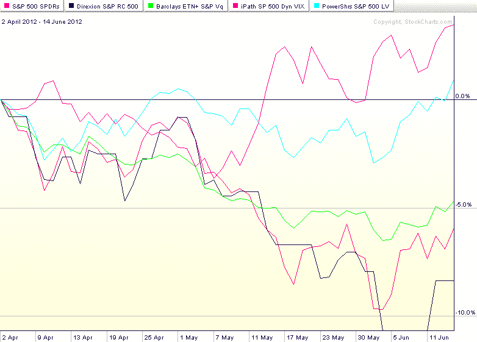

<!--yml

分类：未分类

日期：2024-05-18 16:27:58

-->

# VIX 和更多：波动性对冲 ETP 的表现

> 来源：[`vixandmore.blogspot.com/2012/06/performance-of-volatility-hedged-etps.html#0001-01-01`](http://vixandmore.blogspot.com/2012/06/performance-of-volatility-hedged-etps.html#0001-01-01)

市场整体以及本领域新兴的关注点之一是关于如何将波动性暴露（多头和空头）融合到投资组合中。

根据我收到的反馈，最近三篇文章从不同角度触及了这个主题，都受到了读者的共鸣：

显然，波动性在投资组合中的角色是一个需要进一步分析和讨论的主题。

值得注意的是，交易所交易产品的发行方已经采取了多种方法来应对波动性。最明显的是推出了基于**VIX**的**ETP**产品，比如广受欢迎的**VXX**（iPath S&P 500 VIX Short-Term Futures ETN），它是一个短期**VIX 期货**的多头组合。

随后推出的产品以多种不同方式处理波动性的问题，包括：

1.  利用低贝塔股票最小化投资组合波动性([SPLV](http://vixandmore.blogspot.com/search/label/SPLV))

1.  采用市场时机机制，根据市场波动性的度量动态地在股票和债券之间分配([VSPY](http://vixandmore.blogspot.com/search/label/VSPY))

1.  采用市场时机机制，根据市场波动性的度量动态地在股票和 VIX 期货之间分配([VQT](http://vixandmore.blogspot.com/search/label/VQT))

1.  采用市场时机机制，动态地在多头和空头波动性头寸之间分配([XVZ](http://vixandmore.blogspot.com/search/label/XVZ))

随着标普 500 指数从 4 月 2 日的高点下跌约 6.3%，昨日收盘价为低点，合理地问一下这些方法在熊市阶段的表现如何。下面的图表显示了 SPY 的表现为红色。采用的两种方法的表现轨迹与 SPY 几乎无法区分：VQT（绿色线）；以及 VSPY（深蓝色线），后者交易量较少。

在过去 2 个半月里，表现突出的有两个，分别是 SPLV（浅蓝色线）和 XVZ（紫色线）。从图表中可以看出，SPLV 确实做到了它应该做的事情：最小化波动性。在所述期间的大部分时间里，SPLV 基本保持不变。最近它的上涨主要是由于其对公用事业和必需消费品的大量暴露。另一个突出的是 XVZ，它基本上是利用 VIX 期货的[期限结构](http://vixandmore.blogspot.com/search/label/term%20structure)来决定它在多头和空头波动性头寸之间的分配。由于去年 11 月以来 VIX 期货一直处于[正向市场](http://vixandmore.blogspot.com/search/label/contango)（近期月份价格低于远期月份），这个产品能够利用负[滚动收益率](http://vixandmore.blogspot.com/search/label/roll%20yield)获利，同时还能提供对 VIX 突增的保护。

虽然这些数据对于寻找基于波动性的[对冲](http://vixandmore.blogspot.com/search/label/hedging)策略或甚至投机应用的交易者来说应该是有趣的，但今天绝对是一个例子，过去的表现不应该作为未来一周或两周内预期的指导。

对于那些寻求更强大 VIX 对冲工具的人来说，持有 VIX 看涨期权和 VXX 看涨期权（包括周度期权）将提供最稳健的长波动性对冲。对于那些希望最小化组合未来波动性的人来说，上述四种方法（以及下面的链接）应该值得进一步研究。

相关文章：

**来源：[StockCharts.com](https://example.org)**

**披露：***在撰写本文时持有 XVZ 多头和 VXX 空头*
