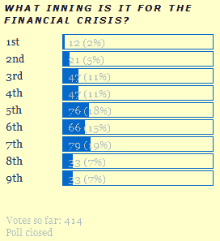

<!--yml

分类：未分类

日期：2024-05-18 18:25:02

-->

# 波动指数 VIX 与更多内容：投票结果：金融危机在第六局开始

> 来源：[`vixandmore.blogspot.com/2008/09/poll-result-top-of-6th-inning.html#0001-01-01`](http://vixandmore.blogspot.com/2008/09/poll-result-top-of-6th-inning.html#0001-01-01)

感谢所有参加 VIX 与更多内容首次投票的人，该投票询问读者“金融危机处于哪个阶段？”

投票结果如图所示。中间投票认为危机处于第六局的早期阶段；平均投票则认为危机处于第五和第六局之间；最普遍的投票是第七局。

投票进行了一周，让我惊讶的是，关于金融危机我们所处的阶段，在周四的传言和周五关于[不良资产救助计划](http://calculatedrisk.blogspot.com/2008/09/paulson-transcript-troubled-asset.html)或 TARP 的宣布之后，看法并没有任何改变。

记录在案，我对这次投票得到的强烈回应感到非常惊喜，并考虑定期恢复这个功能，以便更好地了解博客读者对重要问题的看法。
