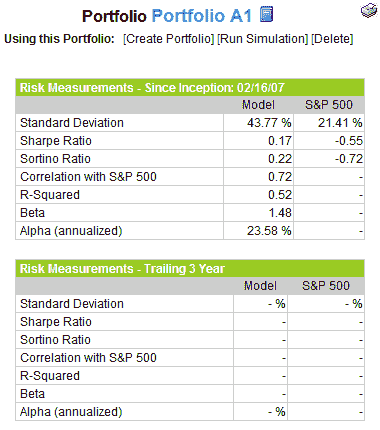

<!--yml

分类：未分类

日期：2024-05-18 18:43:25

-->

# VIX and More: Portfolio A1 Beats SPX by 15.5% in First Year, Helped by Commodity Theme

> 来源：[`vixandmore.blogspot.com/2008/02/portfolio-a1-beats-spx-by-155-in-first_19.html#0001-01-01`](http://vixandmore.blogspot.com/2008/02/portfolio-a1-beats-spx-by-155-in-first_19.html#0001-01-01)

五个重点持仓中的两个是农业和能源，商品主题对 A1 组合有利。[W&T Offshore (WTI)](http://finance.google.com/finance?q=wti)，这家石油和天然气勘探生产公司，如今已经在投资组合中上涨了 15.4%，仅仅两周的时间。上周最大的赢家是[Terra Industries (TRA)](http://finance.google.com/finance?q=tra)，该公司在红火的氮肥领域上涨了 10%。

经过整整一年的表现（自 2007 年 2 月 16 日成立以来），A1 组合正式以+8.23%的回报收入帐面，而同期标准普尔 500 指数下跌了-7.25%，该组合对标准的净绩效收益达到了 15.48%。

就风险调整回报而言，右侧的图表显示，A1 组合在投资组合运营的第一年内平均[beta](http://en.wikipedia.org/wiki/Beta_coefficient)为 1.48，年化[alpha](http://en.wikipedia.org/wiki/Alpha_coefficient)达到了 23.58%。

在很多方面，这个投资组合的建立是为了提供“捕鲸”的专注方法。尽管在第一年中有些不一致，但这种方法在很大程度上是成功的，获得了像[MOS](http://finance.google.com/finance?q=mos)，[DRYS](http://finance.google.com/finance?q=drys)，[TEX](http://finance.google.com/finance?q=tex)，[PBR](http://finance.google.com/finance?q=pbr)，[RIO](http://finance.google.com/finance?q=rio)等强劲的动量股。使找到这么多大赢家成为可能的一部分是非常高的年度周转率。以 674%的周转率来看，这明显是一个交易投资组合，而不是一个买入和持有的方法。亏损通常很快被削减，几乎每周都会有新的机会出现。我期待着看到这个投资组合在第二年的表现，因为我们开始了一个看起来极具挑战性的投资环境。
