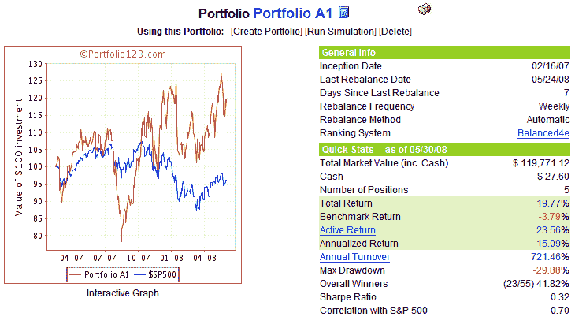
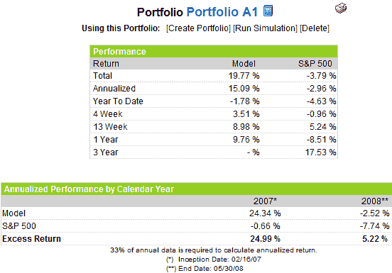

<!--yml

category: 未分类

date: 2024-05-18 18:35:17

-->

# VIX and More: Portfolio A1 绩效更新：2008 年 5 月 31 日

> 来源：[`vixandmore.blogspot.com/2008/05/portfolio-a1-performance-update-53108_31.html#0001-01-01`](http://vixandmore.blogspot.com/2008/05/portfolio-a1-performance-update-53108_31.html#0001-01-01)

由于我继续收到关于[Portfolio A1](http://vixandmore.blogspot.com/search/label/Portfolio%20A1)以及我新的[订阅者新闻简报](http://vixandmoresubscriber.blogspot.com/)模型投资组合的询问，我想在每月末为投资组合提供一个快照。

下面的图表显示了自 2007 年 2 月 16 日创建以来 A1 投资组合的股权曲线和一些摘要统计信息。在成立 15 个半月以来，A1 投资组合（仅限股票，仅限长期）累计回报（不包括股息）为 19.8%，而标准普尔 500 指数则下跌了 3.8%。

右侧的图表提供了 A1 投资组合在各种时间框架内与标准普尔 500 指数的额外绩效详情。

A1 投资组合当前持有以下股票：Mosaic ([MOS](http://finance.google.com/finance?q=mos))；TBS International ([TBSI](http://finance.google.com/finance?q=tbsi))；PetroQuest ([PQ](http://finance.google.com/finance?q=pq))；World Acceptance ([WRLD](http://finance.google.com/finance?q=wrld))；以及 Brasil Telecom Participacoes ([BRP](http://finance.google.com/finance?q=brp))。A1 投资组合还与 VIX and More Focus Aggressive Trader 模型投资组合有一些共同的祖先，并且拥有类似于 VIX and More Focus Aggressive Trader 模型投资组合的股票排名系统，这是我为订阅者每笔交易更新的四个模型投资组合之一的特点。本周末晚些时候，我将提供订阅者新闻简报投资组合表现的一些详细信息。

最后，我要强调一点，A1 投资组合是使用由[Portfolio123.com](http://www.portfolio123.com/index.jsp)开发的工具创建的，并且通过 Portfolio123.com 的工具集进行管理。有关 Portfolio123.com 的更多信息，请参阅早前发布的主题文章，[Portfolio123.com: Portfolio A1 背后的引擎](http://vixandmore.blogspot.com/2007/10/portfolio123com-engine-behind-portfolio.html)。【值得一提，我与 Portfolio123.com 没有任何关联。】
