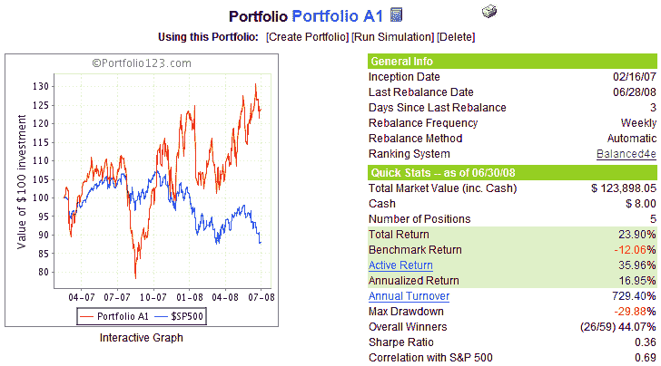
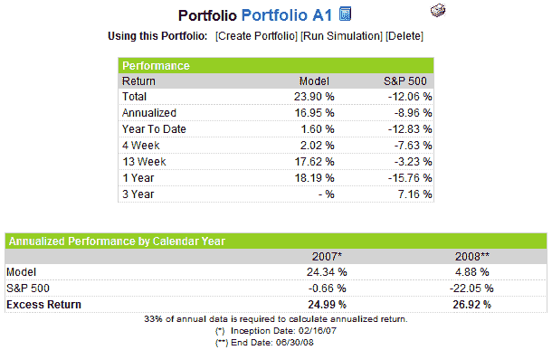

<!--yml

category: 未分类

date: 2024-05-18 18:33:21

-->

# VIX and More: Portfolio A1 Performance Update: 6/30/08

> 来源：[`vixandmore.blogspot.com/2008/06/portfolio-a1-performance-update-63008.html#0001-01-01`](http://vixandmore.blogspot.com/2008/06/portfolio-a1-performance-update-63008.html#0001-01-01)

Per reader request, what follows is a snapshot of [Portfolio A1](http://vixandmore.blogspot.com/search/label/Portfolio%20A1) for the month ended June 2008.

The chart below shows the equity curve and some summary performance statistics for Portfolio A1 since the equities only (no ETFs or options), long only portfolio was created on February 16, 2007.  During the 16 ½ months since inception, Portfolio A1 has posted a cumulative return (exclusive of dividends) of 23.9%, while the benchmark S&P 500 index has declined 12.1%.  This adds up to a net performance of +36.0% for the portfolio vs. the benchmark.

The graphic to the right provides some additional performance details for Portfolio A1 vs. the S&P 500 index over a variety of time frames.  For the second quarter of 2008, for instance, Portfolio A1 returned 17.6%, while the S&P 500 was down 3.2%

For the record, Portfolio A1’s current holdings include: Mosaic ([MOS](http://finance.google.com/finance?q=mos)); TBS International ([TBSI](http://finance.google.com/finance?q=tbsi)); PetroQuest ([PQ](http://finance.google.com/finance?q=pq)); DreamWorks Animation ([DWA](http://finance.google.com/finance?q=dwa)); and Homex Development Corp ([HXM](http://finance.google.com/finance?q=hxm)). Portfolio A1 also shares some common ancestry and has a stock ranking system that is similar to the VIX and More Focus Aggressive Trader model portfolio – one of the four model portfolios that I update transaction by transaction for the VIX and More [subscriber newsletter](http://vixandmoresubscriber.blogspot.com/).

Finally, I would be remiss in not reiterating that Portfolio A1 was created with tools developed by [Portfolio123.com](http://www.portfolio123.com/index.jsp) and is managed via Portfolio123.com’s tool set.  For more information on Portfolio123.com, please refer to an earlier post on the subject, [Portfolio123.com: The Engine Behind Portfolio A1](http://vixandmore.blogspot.com/2007/10/portfolio123com-engine-behind-portfolio.html).
