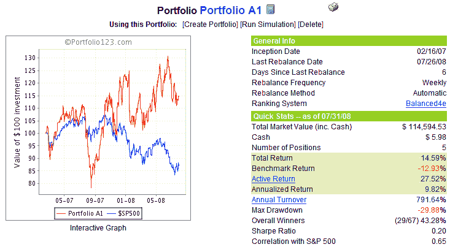

`<!--yml`

分类：未分类

日期：2024-05-18 18:30:57

`-->`

# VIX and More: Portfolio A1 Performance Update: 7/31/08

> 来源：[`vixandmore.blogspot.com/2008/08/portfolio-a1-performance-update-73108.html#0001-01-01`](http://vixandmore.blogspot.com/2008/08/portfolio-a1-performance-update-73108.html#0001-01-01)

如前所承诺，我现在为 Portfolio A1 提供月度业绩更新，该组合是我在大约 1 年半前在博客上推出的。

下面的图表显示了自 2007 年 2 月 16 日成立以来，Portfolio A1 的股票曲线和一些简要的业绩统计数据。在这 17 ½个月的时间里，Portfolio A1 的累计回报（不包括股息）为 14.6%，而标普 500 指数下跌了 12.9%。这意味着组合相对于基准指数的净表现增加了 27.5%。

截至 2023 年 7 月 31 日，Portfolio A1 的持仓包括：Terra Industries([TRA](http://finance.google.com/finance?q=tra)); W&T Offshore([WTI](http://finance.google.com/finance?q=wti)); DreamWorks Animation([DWA](http://finance.google.com/finance?q=dwa)); Synaptics([SYNA](http://finance.google.com/finance?q=syna));以及 Hugoton Royalty Trust([HGT](http://finance.google.com/finance?q=hgt)).记录在案，Portfolio A1 也共享一些共同祖先，并且有一个与 VIX 和 More Focus Aggressive Trader 模型投资组合相似的股票排名系统——我为 VIX 和 More [订阅者通讯](http://vixandmore.blogspot.com/search/label/subscriber%20newsletter)更新的四个模型投资组合之一，逐笔更新。

作为提醒，Portfolio A1 是使用

[Portfolio123.com](http://www.portfolio123.com/)

开发的工具创建的，并通过 Portfolio123.com 的工具集进行管理。关于 Portfolio123.com 的更多信息，请参考之前关于该主题的帖子，

[Portfolio123.com: The Engine Behind Portfolio A1](http://vixandmore.blogspot.com/2007/10/portfolio123com-engine-behind-portfolio.html)

.

