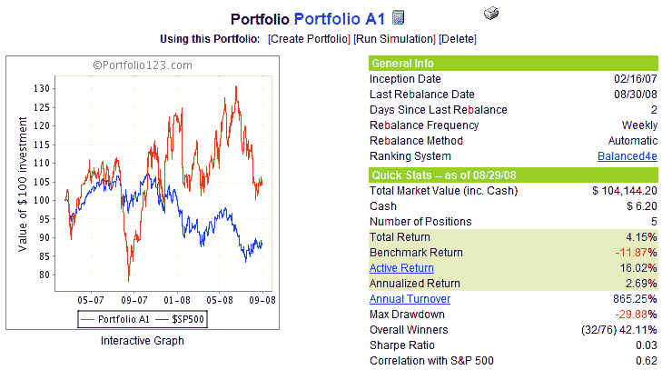

<!--yml

类别：未分类

日期：2024-05-18 18:28:39

-->

# VIX 和更多：投资组合 A1 绩效更新：8/31/08

> 来源：[`vixandmore.blogspot.com/2008/09/portfolio-a1-performance-update-83108.html#0001-01-01`](http://vixandmore.blogspot.com/2008/09/portfolio-a1-performance-update-83108.html#0001-01-01)

如我之前承诺，我现在为我在博客上推出大约 1 年半前的投资组合 A1 提供月度绩效更新。

下图表展示了自 2007 年 2 月 16 日成立以来，仅投资股票（不包括 ETF 或期权）的长期投资组合 A1 的权益曲线和一些摘要性绩效统计数据。在 18 个半月的时间里，投资组合 A1 实现了（不计股息）4.2%的累计回报，而基准的标普 500 指数下降了 11.9%。与基准相比，投资组合的净表现增加了+16.1%。

截至 2008 年 8 月 31 日，投资组合 A1 的持仓包括：克利夫兰-克莉夫斯([CLF](http://finance.google.com/finance?q=clf)); ENGlobal([ENG](http://finance.google.com/finance?q=eng)); Cash America([CSH](http://finance.google.com/finance?q=csh)); EnerSys([ENS](http://finance.google.com/finance?q=ens)); 和 Centene([CNC](http://finance.google.com/finance?q=cnc))。需要说明的是，投资组合 A1 也共享了一些共同的血统，并且有一个与 VIX 和 More Focus Aggressive Trader 模型投资组合相似的股票排名系统——我为 VIX 和 More [订阅者通讯](http://vixandmore.blogspot.com/search/label/subscriber%20newsletter)更新的四个模型投资组合之一，逐笔更新。

作为提醒，投资组合 A1 是使用由[Portfolio123.com](http://www.portfolio123.com/index.jsp)开发的工具创建的，并且是通过 Portfolio123.com 的工具集进行管理的。关于 Portfolio123.com 的更多信息，请参考之前关于该主题的帖子，[Portfolio123.com: Portfolio A1 背后的引擎](http://vixandmore.blogspot.com/2007/10/portfolio123com-engine-behind-portfolio.html)。

[来源：Portfolio123.com]
