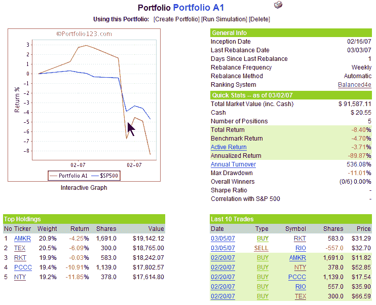

<!--yml

类别：未分类

日期：2024-05-18 15:56:07

-->

# 波动率指数与更多：投资组合 A1 的 2007 年 3 月 4 日更新

> 来源：[`vixandmore.blogspot.com/2007/03/portfolio-update-for-030407.html#0001-01-01`](http://vixandmore.blogspot.com/2007/03/portfolio-update-for-030407.html#0001-01-01)

当我[首次宣布](http://vixandmore.blogspot.com/2007/02/new-feature-2-portfolio123-live.html)我将在这里讨论一个我正在操作的实盘投资组合时，我[非常担心](http://vixandmore.blogspot.com/2007/02/shape-of-capitulation-in-vix.html)时机可能不理想，我应该等待可能的市場调整出来后再推出一个新的投资组合。我基于自己的经验，认为 A1 的前身投资组合在上涨市场中超越标普 500 基准的能力比在下跌市场中要强。也许我应该听从我的直觉…

好吧，不管我们是否已经掌握了那种调整，或者正处于一个更大幅度的熊市早期的阶段，是时候深入研究 A1 投资组合了。正如下面附带的股票曲线所示，由于五个持仓在过去一周受到的打击比指数更严重，A1 的表现已经滑落到了标普 500 指数以下。由于上周的表现，系统对<place st="on">RIO</place>（在过去两年左右一直是喜爱的持仓）的排名下降，触发了出售。<place st="on">RIO</place>被 RKT 所取代，后者是一家在过去一年内股票翻了三倍的包装公司。RKT 拥有相对适度的 2007 年市盈率 16 和 1.9 的 PEG，这使它远低于行业平均水平。除了收入增长的故事与行业趋势形成鲜明对比之外，RKT 还证明了自己在其市场中有持续的定价权。这并不是一只性感的股票，但公司似乎在全力以赴，并且被认为是有吸引力的估值。

股票曲线的一瞥表明，这个投资组合的贝塔值比标普 500 要高；虽然目前情况是这样，很大程度上是因为波动性较大的 AMKR，但用 RKT 替换<place st="on">RIO</place>应该会降低投资组合的整体贝塔值。

记录在案，PCCC 和 AMKR 目前被认为是我这个投资组合中的第一和第二股票。在这样一个充满挑战的市场环境中，这两只股票的表现应该会设定这个投资组合早期表现基调，并决定可能需要缩减的规模，以便将投资组合恢复到盈利状态。

最后，我可能应该已经解释过，这个投资组合是一个只做多头股的股票投资组合。它不允许做空股票，买卖期权，或者利用任何类型的 ETF。因此，系统不会努力对任何头寸进行对冲，无论市场条件如何。下周应该会说明这个策略是否适合当前的市场环境。

