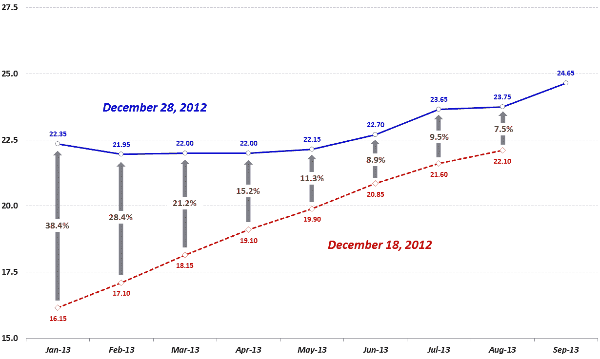

<!--yml

分类：未分类

日期：2024-05-18 16:20:08

-->

# VIX and More: Portfolio Insurance for (Almost) Free

> 来源：[`vixandmore.blogspot.com/2012/12/portfolio-insurance-for-almost-free.html#0001-01-01`](http://vixandmore.blogspot.com/2012/12/portfolio-insurance-for-almost-free.html#0001-01-01)

上周五下午金融市场发生了许多奇怪的事情，其中大部分疯狂表现在[VIX 期货](http://vixandmore.blogspot.com/search/label/VIX%20futures)市场上，影响了像[VXX](http://vixandmore.blogspot.com/search/label/VXX)这样的产品，在不到一个小时内上涨了 11.6%（普通交易时间的最后 40 分钟和盘后交易的前 14 分钟。）

对应的 VIX 期货价格的急剧波动将 VIX 期货的[期限结构](http://vixandmore.blogspot.com/search/label/term%20structure)推向了自 2011 年 11 月以来的第二次[逆向市场](http://vixandmore.blogspot.com/search/label/backwardation)（期限结构曲线向下倾斜，其中最近一个月的期货合约价格高于第二个月合约的市场情况），唯一的例外是 2012 年 5 月 18 日，当时最近两个月的合约逆向市场仅仅 0.05 点。

下图展示了从 12 月 18 日到 12 月 28 日十天内 VIX 期货期限结构的变化。尽管在这两天内所有八个交易的 VIX 期货合约都出现了上涨，但这些上涨的幅度在最近几个月内明显倾斜，其中 1 月 VIX 期货合约飙升了 38.4%，2 月合约上涨了 28.4%，3 月合约上升了 21.2%，等等。值得注意的是，尽管 12 月 18 日的期限结构几乎完美地呈线性上升趋势，但到了 12 月 28 日，期限结构已经扭曲，使得 1 月合约的交易水平高于 2 月、3 月、4 月和 5 月到期的合约。实际上，市场现在正在定价未来五个月内 VIX 大约为 22 的预期。

来源：[CBOE Futures Exchange (CFE)](http://www.cbot.com/)

由于 VIX 期货合约前两个月的逆向市场，这也意味着那些寻求通过增加波动性来对冲长期股票敞口的投资者现在可以利用相当于免费的组合保险。当然，我这里用“免费”这个词是有些宽泛的，但是考虑到短期 VIX 期货（第一个和第二个月的合约）在 80%以上的时间里都处于[正向市场](http://vixandmore.blogspot.com/search/label/contango)（近月合约价格低于远月合约）并且正向市场时会受到与负[滚动收益率](http://vixandmore.blogspot.com/search/label/roll%20yield)相关的价格衰减的影响，我觉得强调短期 VIX 期货的滚动收益现在是正的这一点很重要，这意味着如果 VIX 的 1 月和 2 月合约价格不变，那么正的滚动收益应该会稍微提升 VXX, [UVXY](http://vixandmore.blogspot.com/search/label/UVXY), [TVIX](http://vixandmore.blogspot.com/search/label/TVIX)以及其他带有长期波动性偏好的短期[VIX ETP](http://vixandmore.blogspot.com/search/label/VIX%20ETN)。

现在，在任何人对免费组合保险的可能性过于兴奋之前，重要的是要理解，VIX 期货之所以处于逆向市场，是因为市场参与者预期 VIX 未来会下降，使得长期波动性对冲的价值有限。所以，虽然 VXX、UVXY、TVIX 及其类似产品目前正受益于正的滚动收益，但大多数投资者认为 VIX 和 VIX 期货的下降很可能会抵消由滚动收益带来的任何收益，这意味着这些对冲最终可能算起来是净亏损，当考虑到 VIX 期货的变化和滚动收益时。

*[由于上面的一些主题已经有一段时间没有讨论了，今天的链接集合比平时更全面。和往常一样，这些链接并不是按照重要性排序的，而是按照主题大致分组，最近一些关于这些主题的帖子会排在上面。]*

相关文章：

***披露(s):*** *写作时持有 VXX 和 UVXY 的短期仓位*
