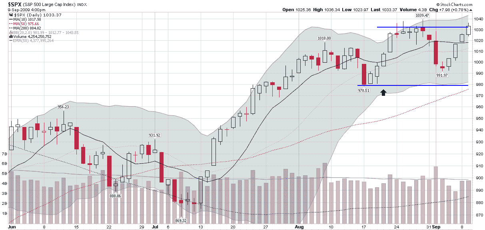

<!--yml

我怀疑当大多数投资者从股票转向期权时，对他们来说最难以接受的问题是[头寸管理](http://vixandmore.blogspot.com/search/label/position%20management)。对于股票，投资者很容易理解，如果某只股票上涨到目标价 X，他或她将获利并退出该头寸。同样，如果股票跌破 Y，这意味着是时候割肉了。

日期：2024-05-18 17:30:17

^(th)

# VIX and More: SPX 短跨式空头头寸管理

> 来源：[`vixandmore.blogspot.com/2009/09/position-management-for-spx-short.html#0001-01-01`](http://vixandmore.blogspot.com/2009/09/position-management-for-spx-short.html#0001-01-01)

-->

对于期权，情况变得更加复杂。其中一个复杂因素无疑是期权头寸可能出现极端百分比变化的潜力。一种情况并不罕见，即期权在连续几天内翻倍增值；或者，期权在连续几天内贬值一半。

-->

让我来谈谈我对最近一次在 SPX 上的短[跨式](http://vixandmore.blogspot.com/search/label/straddle)交易的看法，我首次在 8 月 20 日在[横向交易](http://vixandmore.blogspot.com/2009/08/sideways-play.html)中提到了这笔交易。

首先，虽然我在原始帖子中没有详细说明交易的理由，但我找到吸引我的技术因素之一是 1000 可能作为一个巩固点，SPX 可能交易在一个狭窄的范围内，该范围在当时由 978-1018 定义。下图显示了在初始帖子之后（黑色箭头），SPX 随后上涨至 1040，8 月 27 日收盘略高于 1030。当 SPX 在上周跌破 1000 时，有理由相信 1030（收盘）和 1040（盘中）水平可能充当阻力。正如在[SPX Short Straddle Still Hugging 1000 Level](http://vixandmore.blogspot.com/2009/09/spx-short-straddle-still-hugging-1000.html)中描述的那样，交易在这个阶段开始产生一些有意义的利润。

*[图表：StockCharts]*

分类：未分类

^(th)

) 在 950-1050 范围内。目前，随着 SPX 位于利润区域的上四分之一，最大的风险是向上突破。我认为只要 SPX 不突破 8 月 27 日的水平，风险就相对受控。鉴于我收到的关于如何管理期权头寸的所有问题，我决定今后分享一些我关于使用期权交易的实时案例研究的头寸管理思路。

请回忆起原帖中提到的，如果 SPX 期权在（9 月 19 日

收盘价为 1030.98。留点余地，我设定了一个心理止损点 1032。因此，昨天收盘价为 1033.37，我将通过购买回处于风险中的头寸的一部分，即看涨期权，来关闭 straddle 的一半。理想情况下，这应该是在昨天交易结束前或今天开盘时完成。

下面的图表是截至昨天收盘时的持仓快照。原始的期权费用为每份合约 5000 美元。昨天收盘时，该头寸可以以 3820 美元平仓，每份合约获利 1180 美元。这一利润比上周一 SPX 仍紧贴 1000 点水平时下降了 1490 美元。过去一周内利润的变化主要是由方向性变动(

[delta](http://vixandmore.blogspot.com/search/label/delta)

)在 SPX 上涨 30 点的形式下，超过了本周工作中起作用的时间衰减。

*[图表：optionsXpress]*

我认为没有必要覆盖 straddle 的看跌期权方面，除非 SPX 出现大幅下跌。以 1030 作为阻力转为支撑，如果 SPX 收盘价低于 1030，则可以计划平掉看跌期权。如果我想榨取一些额外的

[时间衰减](http://vixandmore.blogspot.com/search/label/time%20decay)

(

[theta](http://vixandmore.blogspot.com/search/label/theta)

)，来自看跌期权的风险。如果采取这种方法，我可能会使用 1000 点或以下作为我的退出信号。

请注意，在设置我的退出点时，我完全忽略了实际期权的价格，而更愿意关注标的资产。在未来的文章中，我将讨论一种更全面的策略，这不仅仅包括标的资产，还包括期权价格、头寸

[希腊人](http://vixandmore.blogspot.com/search/label/greeks)

及其他因素。

记录在案，这个 SPX 短期 straddle 系列的先前文章是：

1.  [横向交易](http://vixandmore.blogspot.com/2009/08/sideways-play.html)

1.  [SPX 短期买入期权依然紧贴 1000 点水平](http://vixandmore.blogspot.com/2009/09/spx-short-straddle-still-hugging-1000.html)

一个更早的两部分 SPX 短期 straddle 案例研究也可能有兴趣：

1.  [SPX 是否会紧贴 900 点？](http://vixandmore.blogspot.com/2008/12/is-spx-going-to-stick-close-to-900.html)

1.  [SPX straddle 案例研究更新](http://vixandmore.blogspot.com/2008/12/spx-straddle-case-study-update.html)

对于这些主题的额外文章，读者们可以查看：
