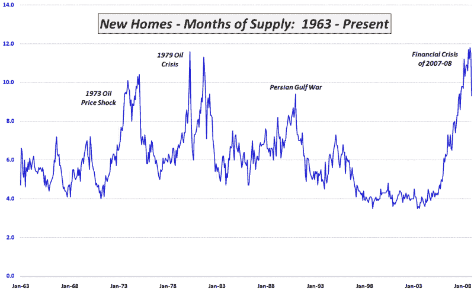

<!--yml

分类：未分类

日期：2024-05-18 18:03:20

-->

# VIX and More: 房屋库存的积极消息

> 来源：[`vixandmore.blogspot.com/2009/01/positive-news-in-housing-inventories.html#0001-01-01`](http://vixandmore.blogspot.com/2009/01/positive-news-in-housing-inventories.html#0001-01-01)

我长期以来一直认为（特别是在[订阅者通讯](http://vixandmoresubscriber.blogspot.com/)中），经济触底过程的关键是[房屋](http://vixandmore.blogspot.com/search/label/housing)和房屋价格的关键是库存。

尽管房屋价格继续下跌，但昨天是长期以来库存方面的首次希望之光。在下图中，我捕捉到了自 1963 以来的房屋库存供应月数。请注意，12 月的数据显示，房屋库存 28 年来最大降幅。

然而，在任何人对此发展过于兴奋之前，有几个警告是必要的。考虑到供应月数是总库存和交易率的函数，这些计算中有几个移动的部分。房屋库存仍然处于与 2004 年初所见水平相当的水平，这意味着在绝对意义上，库存问题在得到解决之前还有很大的改进空间。此外，全国某些地区的多数交易与止赎活动有关。考虑到止赎销售的弹性很高，这一交易率的组成部分必须非常小心对待。

经济可能尚未触底，但已有令人鼓舞的迹象。如果房屋库存继续下降，并且现金开始从货币市场基金中流出，寻求更好的回报，那么可以至少考虑一下股票可能已经转角的可能性。

*[数据来源：美国人口普查局，VIX and More]*
