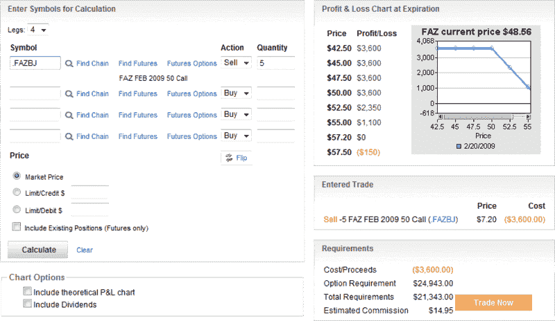

<!--yml

category: 未分类

date: 2024-05-18 18:00:44

-->

# VIX and More: Post-Geithner Financial Naked Calls

> 来源：[`vixandmore.blogspot.com/2009/02/post-geithner-financial-naked-calls.html#0001-01-01`](http://vixandmore.blogspot.com/2009/02/post-geithner-financial-naked-calls.html#0001-01-01)

对于那些极度进取（且资本充足）的投资者来说，他们认为金融行业的波动性在上升，可能还带有一些看多的方向性偏好，那么像以[FAZ](http://vixandmore.blogspot.com/search/label/FAZ)（-3x 金融 ETF）为基础的[熊市看涨期权 spread](http://vixandmore.blogspot.com/search/label/bear%20call%20spread)可能是一个有趣的交易策略。

真正无畏的人甚至可能会考虑出售深度虚值的 FAZ 裸空头 call。在我写下这些文字的时候，FAZ 的交易价格带有 48 的把手，如果出售 2 月 50 的 call，可以得到 7.20，这意味着在交易亏损之前，ETF 还有近 20%的上行空间。当然，对于像 FAZ 这样的三倍 ETF 和[FAS](http://vixandmore.blogspot.com/search/label/FAS)，20%的波动可能在几小时内发生…

**[source: optionsXpress]**
