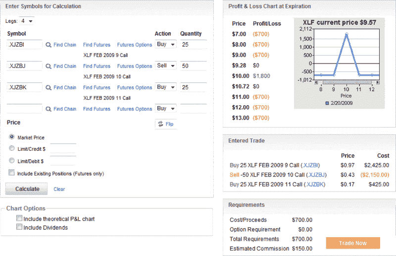

<!--yml

category: 未分类

date: 2024-05-18 18:00:55

-->

# 波动率指数 VIX 与更多内容：盖特纳前的金融蝴蝶效应

> 来源：[`vixandmore.blogspot.com/2009/02/pre-geithner-financial-butterflies.html#0001-01-01`](http://vixandmore.blogspot.com/2009/02/pre-geithner-financial-butterflies.html#0001-01-01)

在这个游戏的这个阶段，很难预测市场是会在盖特纳讲话后因消息而卖出，还是会在进步的可能性上 rally。

有一件事情可能性更大：与金融股票相关的不确定性和波动性可能会显著下降。

参与金融波动游戏有多种方式。一种基本的方式是通过建立一个[蝴蝶](http://vixandmore.blogspot.com/search/label/butterfly)价差交易，如下所示，其中如果[XLF](http://vixandmore.blogspot.com/search/label/XLF)在未来 1 ½周内保持在 9.28 – 10.72 的范围内，它将获利。

**[来源：optionsXpress]**
