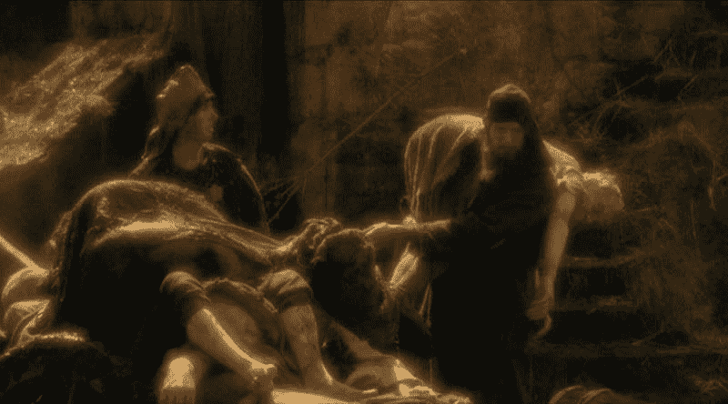

<!--yml

category: 未分类

date: 2024-05-18 19:07:06

-->

# VIX and More: Premature Demise?

> 来源：[`vixandmore.blogspot.com/2007/07/premature-demise.html#0001-01-01`](http://vixandmore.blogspot.com/2007/07/premature-demise.html#0001-01-01)

我总是喜欢那些靠写投资为生的人大胆地预测市场的未来，并且不设防护。

**CXO Advisory Group**（[CXO Advisory Group](http://www.cxoadvisory.com/)）已经将跟踪**市场预测大师**的预测表现当成了一个爱好，并得出结论：作为一个群体，大师们的预测成功率平均起来比掷硬币的结果还要差一点。

对于好坏，这些统计数据并没有阻止**Van Kampen Investments**（[Van Kampen Investments](http://www.vankampen.com/index.asp)）的 Rob Schumacher 预测 VIX“[可能变得像昨天的新闻一样无关紧要](http://www.vankampen.com/vksite/news/commentary/insightline071607.asp)”。Schumacher 指出，**证券交易法**（1934 年证券交易法）中短线交易的“**上升交易规则**”（[Rule 10a-1](http://www.sec.gov/rules/final/2007/34-55970fr.pdf)）的废除是罪魁祸首，并认为无限制的短线交易将导致卖空交易增加，相应地减少对看跌期权的的需求。

尽管未来的看跌期权活动可能有一部分会表现为卖空，但关键问题是规模问题，这很快就会引发杠杆、流动性和交易成本的问题。我最猜测的是，上升交易规则的结束对看跌期权的成交量影响微乎其微，因为短线交易者继续偏好那些看跌期权能够实现的、对大盘股的杠杆化投注。我还怀疑，大多数市场参与者最终都认为全面的组合保险比点状保险更便宜、更有效——而不是编织一个不断移动的、千点的 quilt。

最后，新立法 aside，总是赌任何设立新交易量记录的乐器不受欢迎是危险的，正如 VIX 期权在一周前[创下了新的交易量记录](http://vixandmore.blogspot.com/2007/07/new-vix-options-volume-record-yesterday.html)，在上升交易规则废除后的几天。

如果 Schumacher 是对的，那么我可以退休了这个博客，并把更多时间投入到成为一个更好的交易员。如果他错了，我真心希望他已经用看跌期权对冲了他的仓位…
