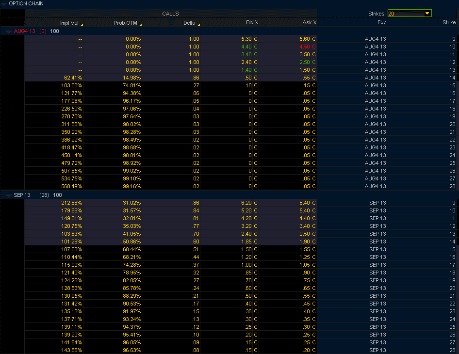

<!--yml

类别：未分类

日期：2024-05-18 16:13:49

-->

# VIX 和更多：八月份和九月份 VIX 期权的定价

> 来源：[`vixandmore.blogspot.com/2013/08/pricing-of-vix-august-and-september.html#0001-01-01`](http://vixandmore.blogspot.com/2013/08/pricing-of-vix-august-and-september.html#0001-01-01)

每月一次的[VIX 期货](http://vixandmore.blogspot.com/search/label/VIX%20futures)和[期权](http://vixandmore.blogspot.com/search/label/VIX%20options)到期日是期权策略角度一个迷人的时刻，因为它标志着 VIX 期货价格与现金/现货 VIX 价格相撞的时间。多亏了[VIX 特殊开盘报价](http://vixandmore.blogspot.com/search/label/VIX%20SOQ)（SOQ），这次价格相撞并不精确，但出于所有实际目的，VIX 当月期货和现金/现货指数每个月都会在周三开盘后一小时左右相撞，这时距离下一个月标普 500 指数期权到期还有 30 天。

为了使事情更有趣，当月 VIX 期货和期权的最后交易日是到期前一周二的交易会。

所有这些产品属性都使得在到期前难以导航 VIX 产品平台的复杂水域，但由于 VIX 具有如此突然的剧烈波动[参见[VIX 历史上的第 11 次尖峰](http://vixandmore.blogspot.com/2013/02/all-time-vix-spike-11-and-treasure.html)以获取一些细节]，期权价格必须包括在到期前最后一刻 VIX 突然飙升的可能性。

正因为如此，有时在到期前最后几分钟内，VIX 期权可能会卖出令人惊讶的高额溢价。在下面的图表中，我从 TD Ameritrade/thinkorswim 平台捕捉了一些数据，这些数据显示了明天到期、在东部时间下午 2:00 左右时各种 VIX 看涨期权的价位，这些产品还有超过两个小时的交易时间。为了进行比较，我还包括了 9 月 18 日（星期二）到期的同一执行价的九月期权。记录在案，在这次快照的时候，VIX 为 14.48，八月份的 VX 期货（现在在 TD Ameritrade/thinkorswim 平台上作为股票代码/VXQ3）为 14.43。

请注意，TD Ameritrade/thinkorswim 平台包括这些 VIX 看涨期权计算出的隐含波动性以及这些期权在 9 月 18 日到期时到期空头的估计概率。从理论上讲，VIX 八月 25 日看涨期权明天开盘时到期在钱的概率超过 1%，而 VIX 九月 25 日看涨期权到期在钱的概率超过 5%。目前，VIX 九月 25 日看涨期权的隐含波动性为 139%，当前买入/卖出价为 0.25 - 0.30。

我并不推荐在到期前出售 VIX 看涨期权，当然我也希望任何对这些类型的交易感兴趣的人在考虑无限制风险的交易之前，先从有定义风险的交易开始（例如，[熊市看涨期权价差](http://vixandmore.blogspot.com/search/label/bear%20call%20spread)）...但潜在的交易机会对我来说至少是迷人的。

*[来源(s): TD Ameritrade/thinkorswim]*

对于那些对 VIX 到期及其潜在交易想法感兴趣的人来说，下面的文章应为一个不错的起点。

相关文章：

***声明(s):*** *在撰写本文时通过期权持有 VIX 的中性立场*
