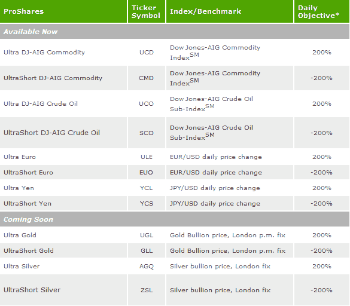

<!--yml

类别：未分类

日期：2024-05-18 18:13:51

-->

# VIX 和更多：ProShares 推出商品和货币 2x 和-2x ETFs

> 来源：[`vixandmore.blogspot.com/2008/11/proshares-rolls-out-commodity-and.html#0001-01-01`](http://vixandmore.blogspot.com/2008/11/proshares-rolls-out-commodity-and.html#0001-01-01)

仅仅 12 天前，我在[预测：Direxion 三倍 ETFs 将改变日交易](http://vixandmore.blogspot.com/2008/11/prediction-direxion-triple-etfs-will.html)中提出了我认为大胆的声明。我本打算跟进，展示这些 ETFs 的成交量如何激增，但[Bespoke](http://bespokeinvest.typepad.com/)在今天发布的[3x ETFs 火爆](http://bespokeinvest.typepad.com/bespoke/2008/11/3x-etfs-on-fire.html)中抢先一步。Bespoke 包含了一些极好的图表，捕捉了这些 ETFs 的极端波动性以及成交量的滚雪球趋势。

不会落后于 Direxion，ProShares 现在正急于推出一组新的 2x 和-2x ETFs，专注于[商品](http://vixandmore.blogspot.com/search/label/commodities)和[货币](http://vixandmore.blogspot.com/search/label/currencies)。

就我个人而言，我越来越多地将我的交易从股票转向 ETFs。我认为 ETF 趋势将持续存在。

[来源：ProShares]
